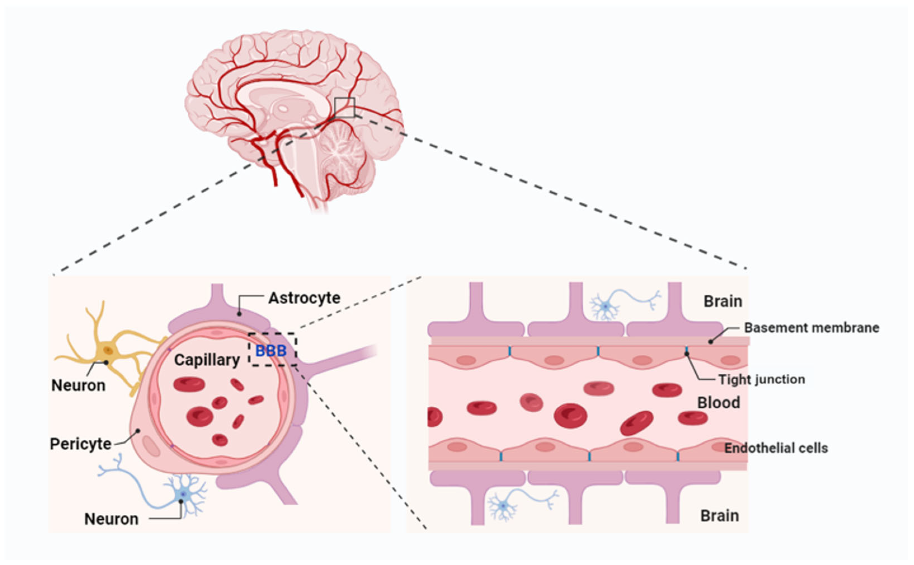
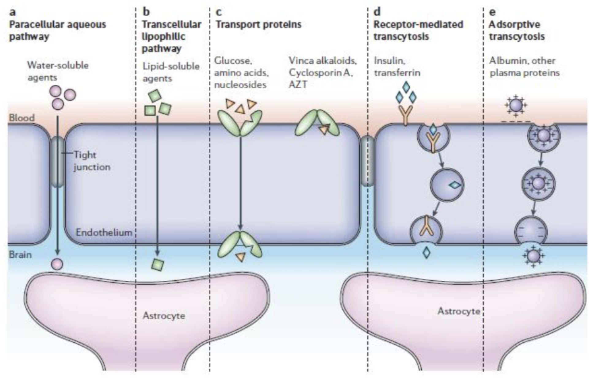

# Blood Brain Barrier (NeuroFys)

Tags: #Neuroscience #CellBiology 

**Endothelial cells** are essential for forming the blood brain barrier by shaping the wall the capillaries of the brain, and in contrast to capilaries in the rest of the body, they form **tight junctions** in the brain. The astrocytes also play an important role in stabilizing the barrier.

What can pass the barrier
- **Tight junctions** in endothelial cells allows water and other small hydrophilic molecules to pass the barrier
- **Oxygen** can pass freely across the membrane
- **Transport proteins** can move glucose, amino acids and nucleotides across the barrier
- Insulin and transferrin through **Receptor-mediated transcytosis**
- Albumin and plasma proteins through **Adsorptive transcytosis**

Some areas in the CNS are without a BBB - this allows for controlled access of stuff?

Together with the **blood-CFS barrier** in the [choroid plexus](Brain_Ventricles_and_CFS_-_%28NeuroFys%29.md), they form the gateway of a lot of molecules to the brain.