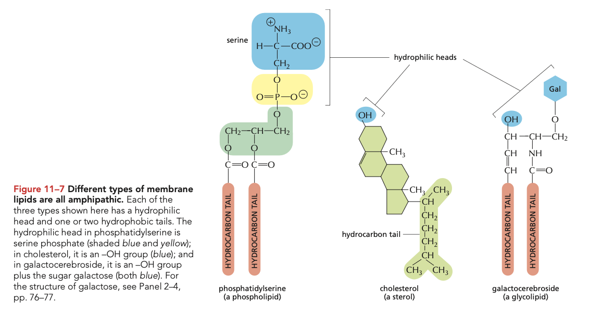
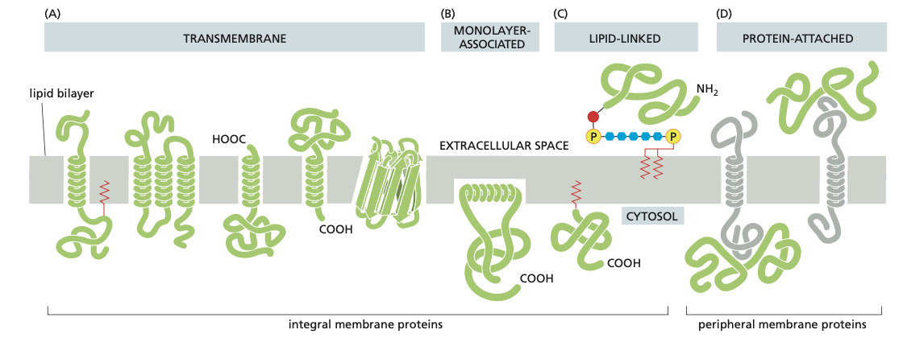
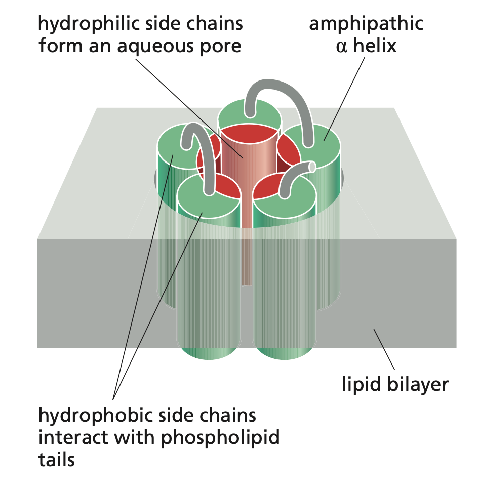
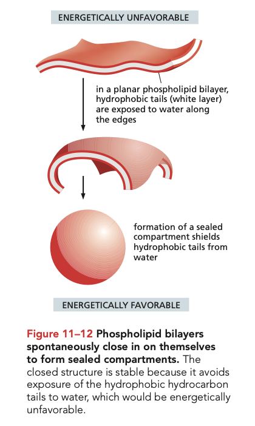
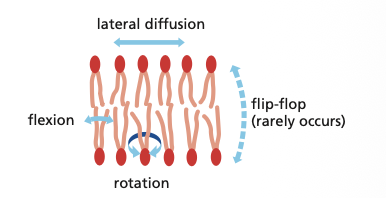
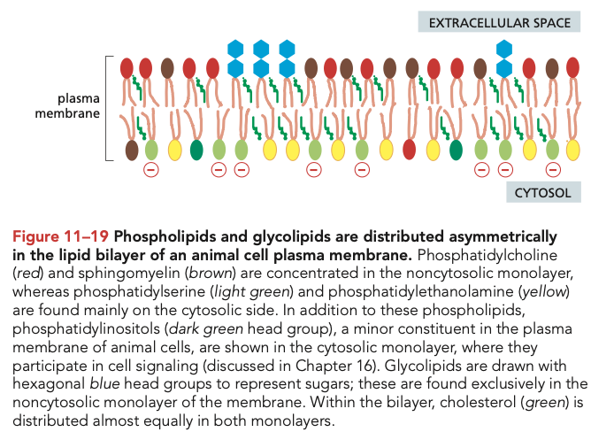
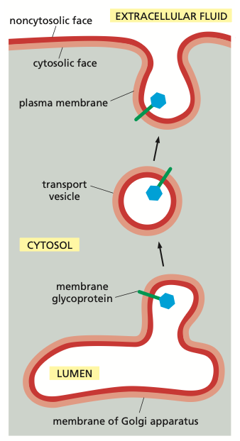
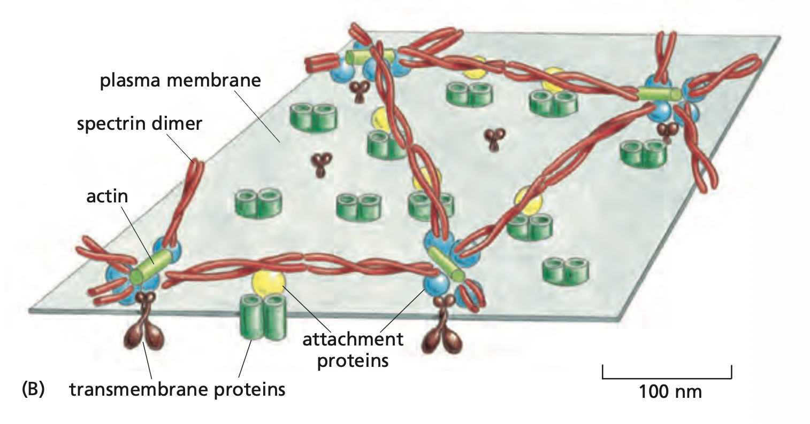
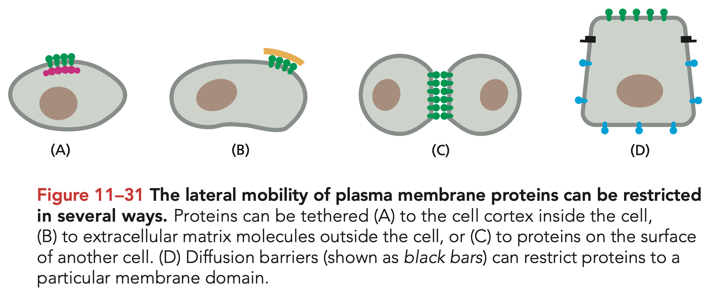

# Cell Membrane Structure

Tags: #Proteins #Chemistry #CellBiology 

The membrane or **lipid bilayer** is one of the most important structures of the cells. Only **50 nm thick**, it is about 1/10000 the thickness of paper. It is of course the outer border of the cell, known as the **plasma membrane**, but it is also used as an **internal membrane** in a wide range of organels including:

- Mitochondria (Both **outer** and **inner** membrane)
- Nucleus (Double membrane?)
- Peroxisomes
- Lysosomes
- Endosomes
- All kinds of transport vesicles
- Endoplasmatic reticulum
- Golgi apparatus

When we talk about a membrane - this includes **both the lipid bilayer**, and the **membrane proteins** 

#### Molecules of the Membrane
The common factor of all molecules in the membrane is that they are **amphipathic** meaning that they have both hydrophobic and hydrophillip parts.
##### Membrane lipids
The main constituents is of course the **membrane lipids**. These can be further subdivided into three classes

**Phospholipids** is the basic structure, making up for most of the membrane molecules in numbers (not weight). These consists of a **hydrophilic head**, which include a **phosphate**, linked to two **hydrophobic lipid tails**, formed from fatty acids. 
- Commonly one tail is **saturated** (meaning no double bonds - hydrogen saturation), while the other is **unsaturated** (at least one double bond). The amount of saturation among the phospholipids affects **the fluidity of the membrane** - More saturated tails - less fluid.
- The double tail allows the phospholipids to combine into the **sheets** of the lipid bilayer, whereas **single tail lipids (detergents)** instead form spheres called **micelles**

**Sterols** (usually **cholesterol**) consists of a hydrophilic head (hydroxyl group), a **rigid planar hydrophobic steroid** and a hydrophobic tail (hydrocarbon).
- The sterols decreases the fluidity of the membrane

**Glycolipids** is similar to phospholipids, but instead of a phosphate based hydrophilic head, they have carbohydrates - often **oligosaccharides** and **monosaccharides**. 
- These sugar structures can be composed in a wide range, and they thus play a role in identifying cells.

##### Membrane Proteins
**Proteins** make up for about **50% of the weight** of the membrane, although the ratio is about **50 lipids to 1 protein**. They are responsible for most of the membrane functions. 
- **Transporters** move specific molecules **in and/or out** of the compartment. This is often done inversely the the electrochemical gradient of the molecules, and thus they often **require energy** (ATP, coupled transport, etc.) - E.g. $Na^+/K^+$-pump
- **Channels** creates most of the **permeability** of the membrane, allowing the **influx** and **efflux** of specific molecules - E.g. the $K^+$ leak channels and the voltage-gated channels
- **Anchors** are proteins that binds to macromolecules on the **inside, outside or both**. - E.g. the integrins, which link intracellular actin filaments to extracellular matrix proteins
- **Receptors** that detects chemical signals, and relays them to the cells interior - E.g. growth factor (PDGF) receptor
- **Enzymes**, that catalyzes reactions on the membrane - E.g. adenylyl cyclase which catalyzes cyclic AMP in response to an extracellular signal (Sort of a receptor i guess) 

The membrane proteins can be subdivided into **integral membrane proteins**, which is an actual part of the membrane, and **peripheral membrane proteins**, which is attached to other membrane proteins, and thus can be more easily added or removed. 

The integral membrane proteins can be **transmembrane** if they penetrate both monolayers of the lipid bilayer, **monolayer-assiciated** if they are only present in one monolayer (either side), and **lipid linked**, if they are merely covalently linked to one or more membrane lipid.

Because of the hydrophilic backbone of the proteins, they have to form specific conformations, that shields the backbone by hydrophobic side chains towards to lipid tails
- **Single $\alpha$-helices** with hydrophobic side chains can penetrate the bilaier
- **Multiple $\alpha$-helices** can form a **pore** by multiple **amphipathic** $\alpha$-helices forming a ring, with hydrophilic sides pointing inwards (towards the channel) and hydrophobic sides pointing outwards (towards the lipid bilayer)
	
- **A $\beta$ barrel** can be formed of a $\beta$ sheet folded into a cylinder, with one side being hydrophilic and one side being hydrophobic

#### Composition of the Membrane

##### Hydrophobic forces
The lipid bilayer of the membrane is kept together not by bindings, but by **hydrophobic forces**.
- Since both the intracellular and extracellular environments are aqueous, the hydrophobic **tails of the membrane lipids is being pushed together**, to minimize the **thermodynamical energy cost** of the cage-like structures formed by the water around the hydrophobic molecules. 
- Because of the double tails, the lipids cant easily form small spheres, such as micelles, and instead form **sheets** of two layers - two hydrophilic sides, with a hydrophobic center. This large sheets then form **compartments**, to "shield" the hydrophobic sides:

##### Fluidity
The membrane is incredibly flexible as it can change shape, grow, and move without breaking. This is a result of the **fluidity** of the membrane.
- As the membrane lipids as not bound together, they are free to move in the two dimensional plane, that is the membrane - lipids and membrane proteins are know to move around - **lateral diffusion**, and rotate along the axis ortogonal to the membrane. 
- They don't **flip-flop** across the bilayer spontainously (Once a month per lipid on average)

The fluidity is important for a number of reasons
- Fast diffusion of membrane proteins, which is import in protein interaction, and for the spread of proteins from the sites of insertion to the whole cell. 
- Its an important part of membrane fusion

The fluidity of the membrane is determined mainly by two factors:
- The **length and saturation** of the lipid tail
	- Saturated tails allows the lipids to pack together tightly, increasing the resistance of movement in the membrane
	- Plant fats are usually unsaturated and oils are therefore liquid, while animals fats and butter are more saturated and thus "solid". 
	- This is used in bacteria and yeast cells, which modulates saturation dependent on the temperature to keep a constant fluidity of the membrane
- The inclusion of **sterols** (in animals the is almost always **cholesterol**)
	- The **planar** parts of the sterols fits the spaces left by the **kinks** of unsaturated tails, and thus decreases the flexibility (and permeability)

##### Asymmetry
The lipid bilayer is not symmetrical in composition. This is evident both for membrane lipids and membrane proteins. Most noticable is the **glycolipids** which is almost exclusively present in the extracellular space (lumen when inside the cell).

The same side of the membrane always points towards the cytosol. This means, that the extracellular side points inwards in the **lumen** when part of the ER and golgi apparatus, and is inwards when part of **transport vesicles**. 

##### Cell Cortex
The membrane in animals is often **reinforced** by an **interior** cell cortex of protein filaments, which is attached to the membrane by the transmembrane proteins (**anchors**). An example is the cortex of the **red blood cells**, which gives them their concave shape.
- 

##### Restriction of Movement
Sometimes we want to keep some proteins in specific regions of the cell - for example the transports proteins responsible for the uptake of nutrients in the epithelial cells of the gut. That is we want to **restrict the diffusion of the membrane proteins**. This can be done in multiples ways
- A **tight junction** can act is a **diffusion barrier**, that stops proteins from moving past
- Extracellular matrix and cell cortex, can anchor the proteins in place
- Similarly proteins on a neighbour cell can keep each other in place

##### The carbohydrate surface of the cell
Just as the **glycolipids**, many of the transmembrane proteins have chains of sugars attached. **Glycoproteins** have oligosaccharides, while **proteoglycans** have long polysaccharide chains. Togther with the glycolipids these form the **glycocalyx** or **carbohydrate layer**. This sugar coating serves multiple purposes
- It protects the membrane against mechanical damage
- The sugars attracts water, which results in a slimy surface that decreases friction between cells - e.g. white blood cells, that needs to squeeze through small openings. 
- They create a **finger print of the cell type** which can be recognized by other transmembrane proteins known as **lectins** 
#### Development of the Membrane
The phospholipids are synthesizes by enzymes on the surface of the **endoplasmatic reticulum**. 
- These membrane lipids are added to **the cytosolic side** of the ER bilayer.
- Since they don't flip-flop spontaneously, the movement to the other bilayer is **catalyzed by scramblase** - a type of **transporter protein**. 
- Thus the phospholipids are evenly distributed among the layers. 
- From here it is compartmentalized and distributed among other organelles - especially the **golgi aparatus**

In the **golgi membrane** the asymmetry of the membrane is formed
- Another transporter protein called **flippase** flips specific phospholipids from the extracellular side, to the cytosol side

More on the compartmentalization later!

