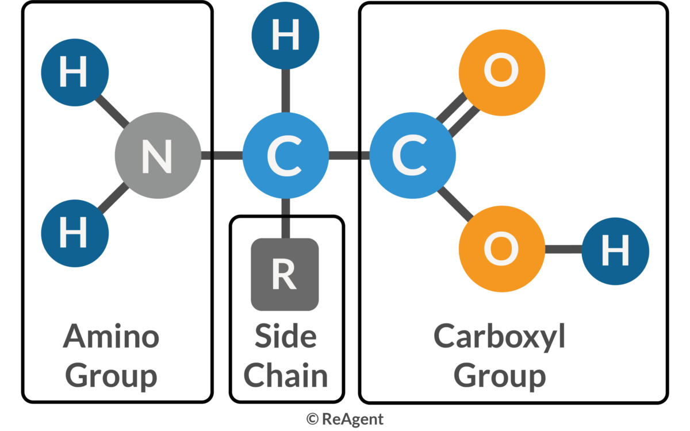

# Protein Structures and Shapes

Tags: #Proteins #Chemistry

By far the most prevalent molecules in the cell in terms of dry mass providing shape and structure to the cell, intracellular chemical reactions as **enzymes**, **transporters** and channels **through** the membranes, **signalling** inter- and intracellular, and a vast list of machinery parts with various functions. One classification of proteins:

- **Enzymes** catalyze covalent bond breakage or formation
- **Structural Proteins** provides mechanical support - E.g. Collagen
- **Transport Proteins** carry small molecules - E.g. Hemoglobin
- **Motor Proteins** generates movement - E.g. Myosin
- **Storage Proteins** store amino acids or ions - E.g. Casein in milk
- **Signal Proteins** carry extracellular signals - E.g. Insulin
- **Receptor Proteins** detects signals and transmits them - E.g. Acetylcholin receptor and Rhodopsin (Light sensitive)
- **Transcription Regulators** binds to DNA to switch genes on and off 
- **Special-Purpose Proteins** - E.g. Flourescent protein

#### Amino Acids
Amino acids are molecules recognized by the **tertiary** $\alpha-$carbon with an **amino group** 
($pK_a\approx 10$), a **carboxyl group** ($pK_a\approx 2$), a hydrogen and a side chain. Many amino acids exist, but only 20 are a part of the proteins in humans.

The amino terminus are called the **N-terminus**, and are drawn to the left, while the carboxyl terminus or **C-terminus** are drawn to the right. The side chain have a variety of functions, some being **hydrophobic**, some having electrical charge, and some able to form special covalent bonds with other side chains.

The ionization of the amino group and carboxyl group is dependent on the pH of the environment (cytosol):

All 20 common amino acids are show in the following table:

#### Primary Structure - Sequence of the Chain
The amino acids form **peptide bonds** between the amino group and the carboxyl group through a condensation reaction. The organization of amino acids in the sequences of the polypeptide chains is called the **primary structure** of the proteins, with an N-terminus and a C-terminus. The peptide bonds are rotation-locked, meaning that it can be a **cis bond** or a **trans bond**. Because of the **steric clashes** (too small van der waal radius) of the side groups of the amino acids, the trans peptide bonds are much more common. 
- Insert figure 

The bonds between the $\alpha$-carbon and the amino group and carboxyl group respectively are free to rotate, though some combinations of rotations are **energetically favorable**. The angle of rotation of the amino group is called $\Phi$ (Phi) and the angle of rotation of the carboxyl group is called $\psi$ (Psi). 

The favorable combinations are found experimentally and shown in this **Ramachandram** plot:

This ramachandram plot is general, but there also exists independent plots for each amino acid

#### Secondary Structure - Local Shape of the Chain 
Given the flexibility of the rotation of the bonds, the peptide chains can fold in an enormous number of ways. The shape is constrained by a number of  non-covalent bonds.
The secondary structure, is a description of the regularly repeating structure in the peptide chain. Such include $\alpha$-helices, $\beta$-pleated sheets, $\beta$-turns, and $\Omega$-turns.
##### $\alpha$-helix
The helix is common because it's formed by the peptide backbone and not the side chains. It exists in two mirror forms - the **abundant right-handed $\alpha$-helix** (show in figure below) and the rare left-handed $\alpha$-helix. The helix is formed by hydrogen bonds between **every fourth** amino acid, formed between the N-H of the amino group and the O=C of the carboxyl group (ketone in the chain). This pattern forms a **full turn every 3.6 amino** acid with a **distance of 0.54 nm** (Or 5.4 Å).

$\alpha$-helices are **abundant in membrane proteines**, as the polar peptide backbone can be shielded by hydrophobic side chains protruding on the outside of the helix.

Two (or three) $\alpha$-helices can form together to a **coiled-coil structure**, when they have hydrophobic side chains on one side of the helix, which can be faced inwards in against hydrophobic side of the other helix (helices) and twist around each other minimizing cytosol contact. These are present in **$\alpha$-keratin** (hair, skin) and **myosin** (muscles), and they give **wool fibers** their extraordinary property of regaining their structure after stretching.
##### $\beta$-pleaded sheet
Just as the $\alpha$-helix, the formation of $\beta$-sheets only rely on the peptide backbone and not the side chains. The backbone in each strand is roughly planar, with side chains protruding to alternating sides of the plane. Each $\beta$-sheet consists of multiple parallel and antiparallel strands, keeping each other in place with hydrogen bonding:
- The **antiparallel strands** connect directly across - as the strands run in **opposite directions**, the amino acids are flipped, and the N-H and C=O can form hydrogen bonds to the opposite amino acid
- The **parallel strands** cant form direct bonds as the strands run in the **same direction**, so the N-H forms hydrogen bond the the C=O in an amino acid adjacent to the left, while the C=O forms bond to an amino acid on the right. 

The sheets can come together purely parallel, purely antiparallel or a mix. The distance between aminos in the $\beta$-strands is 0.34 nm (in contrast to 0.15 nm in the $\alpha$-helix). The shape of the $\beta$-sheet can be planar, but often it is somewhat twisted:

It is a structural important element of many proteins - it gives **silk fibers** the tensile strength (resistance to pull) and form the basis of **amyloid structures**.
##### Turns
Turns are not regularly repeating structures, but are analyzed on the secondary structure level. The **reverse turn** ($\beta$-turn or hairpin turn) is a structure with a hydrogen bond between the backbone of two amino acids spaced three paces apart, and outwards protruding side chains. 

The **$\Omega$-loop** is defined as a larger structure, with more aminos in between the loop neck. Loops are mostly present on the surface of proteins.

Though all amino acids partake in these substructure, there is a difference in frequency, which can help predict shape:

#### Tertiary Structure - Global Shape of the Chain
The final shape called the **conformation** is determined energetically, by the shape that minimizes its free energy (G). Thus the folding process **releases heat and decreases entropy**. A number of bonds plays a part in determining the conformation of the chains:

- **Hydrogen bonds** between polar side chains or the amino and carboxyl groups
- Electrostatic attractions between **electrically charged** side chains or **partially charged** polar groups
- **Van der waals** attraction - both pushing and pulling
- Hydrophobic forces - **non-polar side chains being forced together** to the inside in aqueous environments

As a general rule of thumb - non polar side chains points inwards, whereas polar side chains point outwards, unless hydrogen bonded to other side chains or the peptide backbone.

However, some proteins reside in hydrophobic environments such as membranes, and form structures with a hydrophobic shell and polar internal structures, such as this membrane channel, **porin**:

Some polypeptide chains fold into two or more compact regions that may be connected by a flexible segment of polypeptide chain. These compact units, called **domains**, range in size from about 30 to 400 amino acid residues. 

#### Quaternary Structure - Multiple Polypeptide Chains
Larger proteins contain more than one polypeptide chain. In these proteins each polypeptide chain called a **subunit** is connected at certain **binding sites** by non-covalent bonding. 

These larger structures can consist of similar repeating subunits. A **dimer** is the simplest case with two identical chains in a symmetrical complex, such as the CAP protein. If the subunits have two complementary binding sites, manu subunits can form helices or rings, depending on the angles.

An abundant example of this is **Actin** which forms helix structures, and forms a major filament system in the cytoskeleton. Other large structures that form are **tubes** such as microtubules and **spherical shells** such as virus vectors. 

The proteins forming individual units are called **globular proteins**, but the ones forming long repeating structure are called **fibrous proteins**. These sort of fibrous filaments also play a role in forming the **extracellular matrix**, especially **collagen** molecules.

These larger structure often include other molecules than poplypetide chains such as RNA, DNA and non-organic molecules such as the **heme** in hemoglobin.

#### Folding and keeping the structure
The sequence of amino acids solely determines the final conformation, and proteins that has been **denatured** by urea (disrupting non-covalent bonds) and $\beta$-mercaptoethanol (reduces disulfide bonds) for example will often recover it conformation after the urea is removed (renaturation).

Protein folding is generally catalyzed by chaperone proteins, which speeds up the proces of finding the energetically favorable pathway. Some of these binds to the partially folded structures, while others completely encase the polypeptide chains.

Covalent **disulfide** bonds between the side chains of **cysteine** (and other less common covalent bonds). These bonds does not dictate conformation, but keeps it stable. 

##### Misfolding
Sometimes proteins fold incorrectly, putting them out of function. However, sometimes thay form **amyloid structure** that can damage cells and tissues. These contribute to neurodegenerative disorders such as Alzheimer's and Huntington's disease. 

Another dangerous misfolding are proteins called **prions**. These are self-replicating in the sense that they convert the correctly folded versions to its own misfolded version (**zombie-proteins**) which then aggregates. This include scrapie in sheep, bovine spongiform encephalopahty (mad cows disease) in cattle and Creutzfeldt-Jakob disease in humans. In contrast to amyloid structure diseases, prions are **infectious**. 