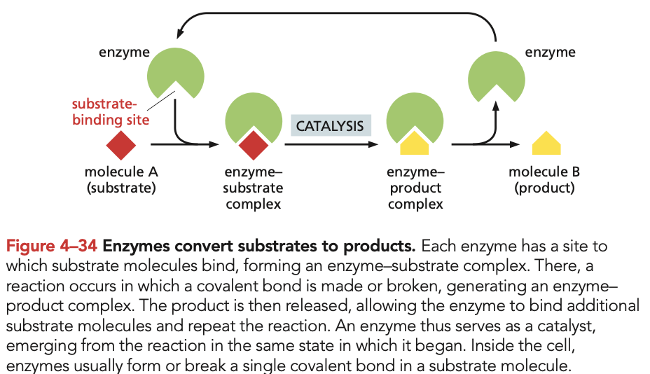
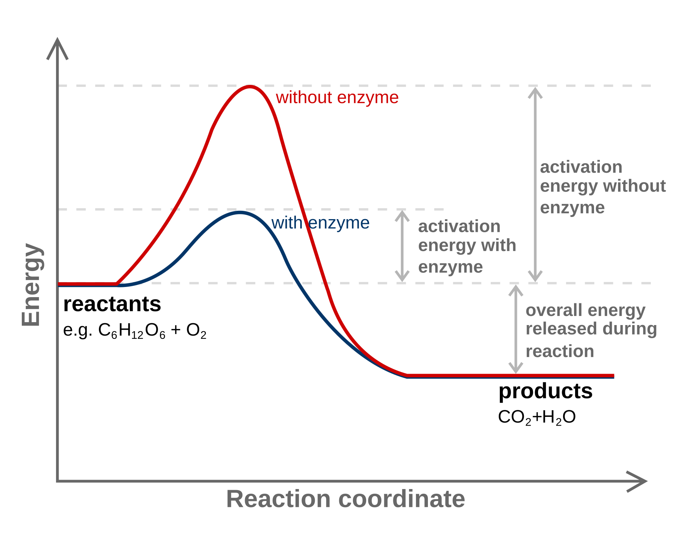
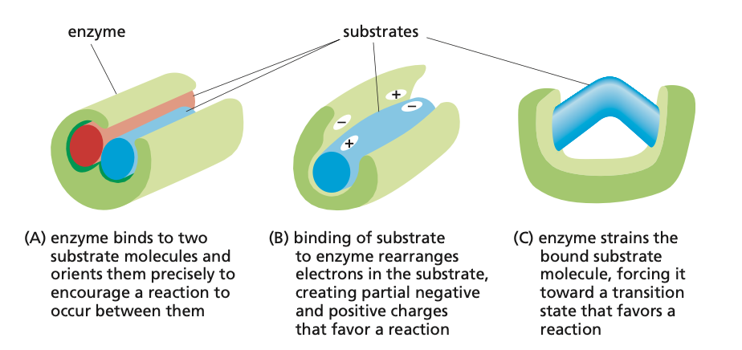
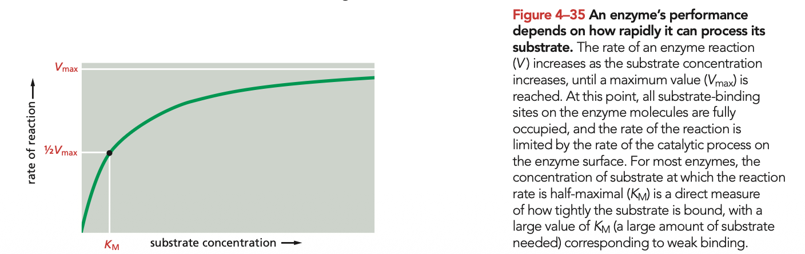

# Protein General Function and Enzymes

Tags: #Proteins #Enzymes 

All proteins stick or bind to other molecules in a specific manner. This substance, whether it is an ion, an organic molecule or a macro molecules, is called a **ligand**. The high specificity of the binding of proteins is a result of the large set of non-covalent interactions between the ligand ond the protein, making it a relation between hand and glove. 

The region of the protein binding to the ligand is called the **binding site** formed by a physical cavity (or other shape) of the protein, and the arrangement of side chains in this area. These side chains often comes from amino acids far apart in the sequence, but close in proximity. Proteins often have **multiple binding sites**, some of which have external functionality, and some of which acts upon the protein it self (such as inhibition).

The proteins have a variety of functions:
- Static, such as **actin**, which binds to other actin molecules to **form filament**.
- Movement for **motor proteins** such as kinesin, which binds to microtubulis
- **Antibodies** which binds to specific antigens, and signals specific protetion cells such as phagocytic cells (and many other functions)
- Enzymes catalyzes chemical reactions by binding to substrates (and products)
- Hella lot more functions

#### Enzymes
An important class of proteins that **catalyzes almost all chemical reactions** in the cell, while retaining it's own structure. In general enzymes bind to one or more **substrate**, creates **favorable conditions** for a reaction that transform substrate to **product** which is then released from the enzyme. 

Enzymes **cannot make energetically unfavorable reactions happen**, unless this is part of a coupled or sequential reaction, with a sum total negative $\Delta G$. They can however catalyze energetically favorable reactions, that have a very high activation energy, meaning that they practically never happen freely in the cytosol. They do this by **lowering the activation energy** of the reaction, by hosting to right conditions in a variety of ways, and thus speeding up the reaction, often by a factor of one million or more.

The activation energy is lowered, by the binding site being a comfortable fit for the substrate to enter the **transition state**, in which the reaction can spontaneously happen. This is by the many non-covalent forces, that strains the bound substrate molecule, changes the partial electron distribution and molecule orientation.

Enzymes can catalyze reactions that bind multiple molecules, split single molecules or alter molecular structure. Some classes of enzymes is given here:

| **Enzyme class** | **Biochemical function**                                 |
| ---------------- | -------------------------------------------------------- |
| Hydrolase        | Catalyzes a hydrolytic cleavage reaction                 |
| Nuclease         | Breaks down nucleic acids by hydrolysis                  |
| Protease         | Breaks down polypeptide chains by hydrolysis             |
| Ligase           | Joins two molecules together                             |
| Isomerase        | Catalyzes rearrangements if bonds within a molecule      |
| Polymerase       | Catalyzes polymerization reactions                       |
| Kinase           | Catalyzes additions of phophate groups to molecules      |
| Phophatase       | Removes phostphate groups by hydrolysis                  |
| Oxido-reductase  | Catalyzes oxidation-reduction reactions of two molecules |
| ATPase           | Hydrolyzes ATP                                           |

##### Enzyme kinetics - Michaelis-Menden
The number of **enzyme-substrate complex** and speed of the reaction in which they are formed is dependent on the koncentration of the substrate and the enzymes themselves. At low concentration of substrate, this is the governing factor, and as the concentration increases, the speed will **converge towards $V_{\text{max}}$**, which is the maximum speed of the given concentration of enzymes. As it converges, it is difficult to determine the concentration of substrate at $V_{\text{max}}$ we describe the concentration at the speed $\frac{1}{2} V_{\text{max}}$ called the **Michealis constant** - $K_m$. A large $K_m$ indicates weak binding, while a small $K_m$ indicates strong binding. The speed can be described at a function of substrate concentration for a given enzyme concentration:
$$v=\frac{dp}{dt}=\frac{V_{\text{max}}[S]}{K_m+[S]}$$

Some protein functions are a result a small non-protein molecules bound to the proteins. This could be **retinal**, that makes rhodopsin photoreceptive, and the iron containing **heme** of hemoglobin, that binds oxygen. In enzymes these non-protein molecules are often called **coenzymes**.