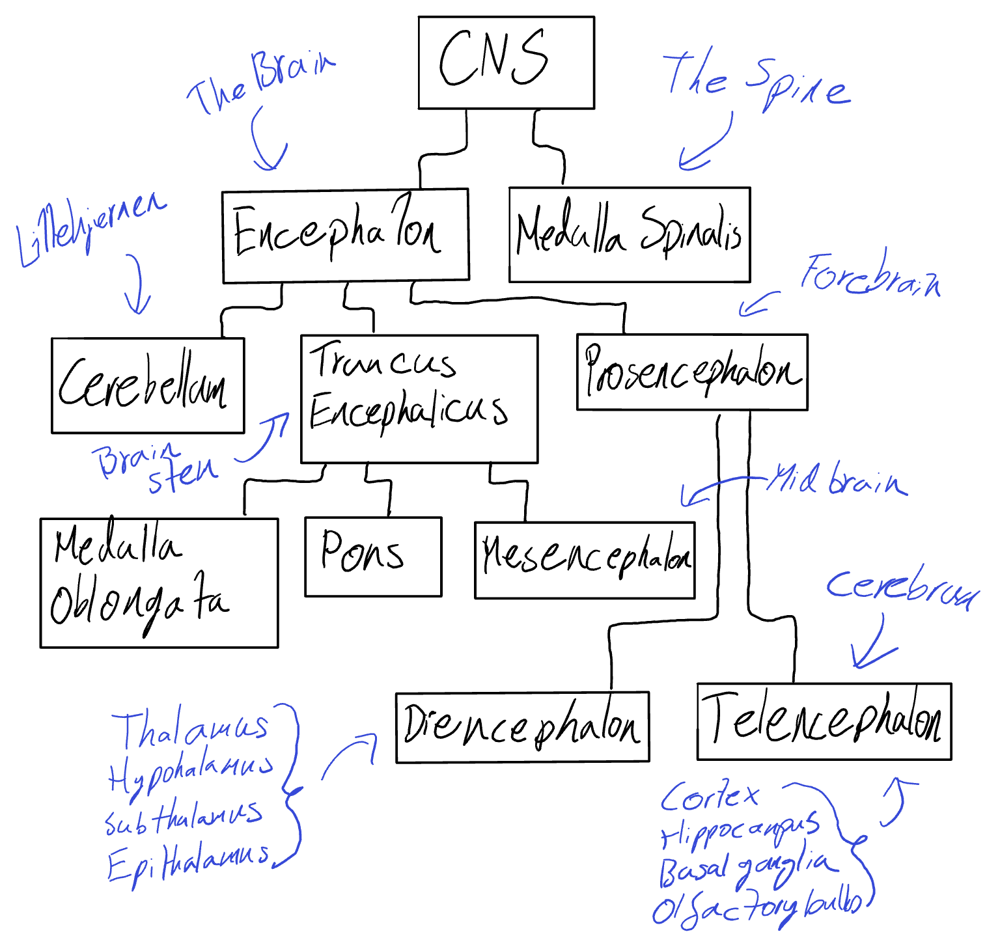
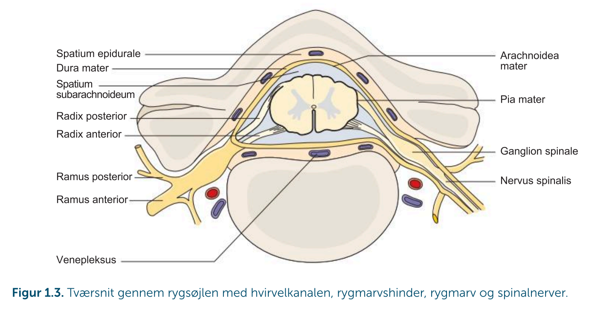
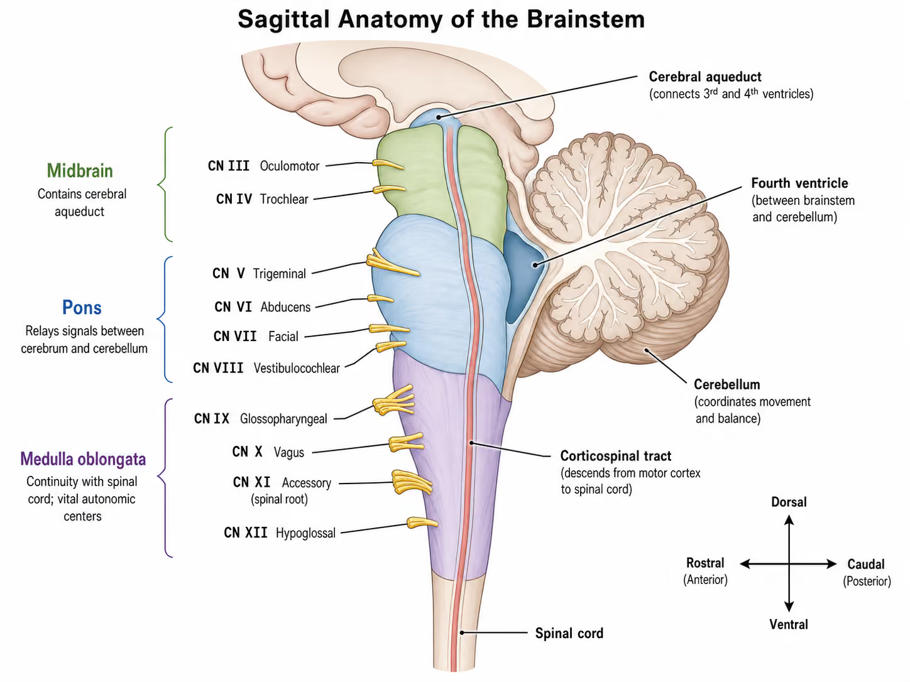
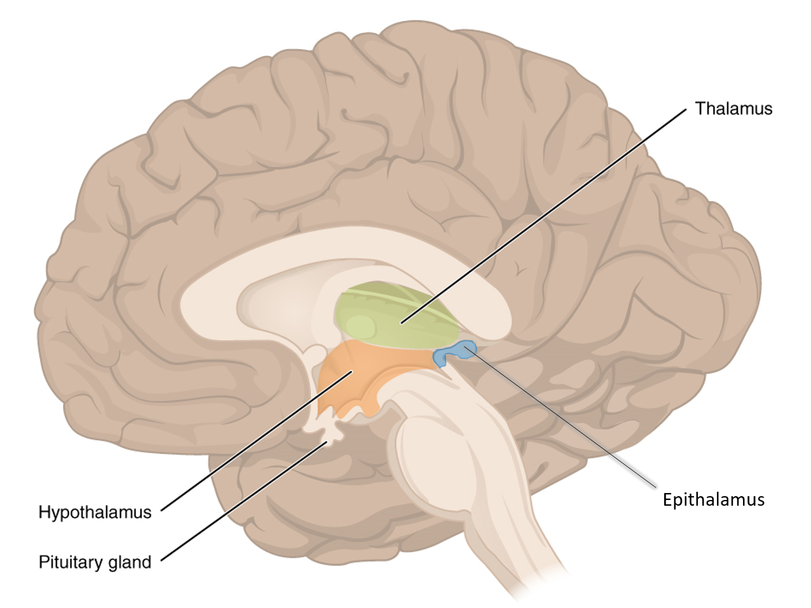
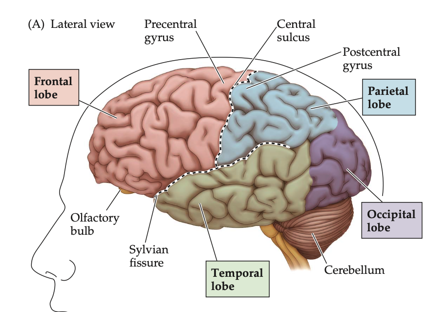

# The Central Nervous System (CNS) (Neurofys)

Tags: #Neuroscience #Neuroanatomy 

Terms for understanding [Brain Orientation and Location - Cheat sheet (NeuroFys)](Brain_Orientation_and_Location_-_Cheat_sheet_%28NeuroFys%29.md)

The whole CNS and all of its parts:

The Central nervous is the part of the nervous system inside the spine and the cranium. It is divided into the **encephalon** (Greek for *en*: in and *kephale*: head) and the **medulla spinalis**, (Middle of the spine). 

#### Medulla Spinalis
The spinal chord is a cylindrical chord. It has a narrow fluid filled channel called the **canalis central**, which is surrounded by first grey matter and then white matter. Its surrounded by three **meningial membranes** called dura mater, pia mater, and arachnoidea mater. From medulla spinalis 31 pair of spinal nerves protrude.

The encephalon has three divisions - **cerebellum**, the brain stem or **truncus encephalicus**, and the fore brain or **proencephalon**. 

#### Truncus Encephalicus
The brainstem consists of three parts:

##### Medulla Oblongata
The end part of the spinal chord, that connects it to the rest of the CNS, while retaining vital autonomic functions such as heart rate, vomiting and sneezing. 
It also hosts four cranial nerves:
* CN IX - **Glosspharyngeal**: Taste and salivation
* CN X - **Vagus**: Connection to the parasympathics system in the neck, chest, and abdomen 
* CN XI - **Accesory**: Supplies the neck muscles sternocleidomastoid and trapezius
* CN XII - **Hypoglossal**: Tongue movement
##### Pons
The pons is the bridge between cerebellum and cerebrum.
Pons hosts the cranial nerves:
* CN V - **Trigeminal**: Sensation to skin of the face and chewing muscles
* CN VI - **Abducens**: Part of eye movement
* CN VII - **Facial**: Controls the muscles of facial expression
* CN VIII - **Vestibulocochlear**: Sensation of balance (vestibular) and hearing (cochlear)
##### Mesencephalon
Also called the mid brain
Mesencephalon hosts the cranial nerves:
- CN III - **Oculomotor**: Controls most of the muscles in eye movement
- CN IV - **Trochlear**: Controls a single muscle in eye movement

#### Cerebellum
Consists of two latteral hemispheres and a central part **vermis**. The cerebellum is connected to all tree parts of the brain stem. 

##### Diencephalon
In danish - Mellemhjernen, is a part of proencephalon, located rostal from mesencephalon and creating the wall in the latteral third ventricle. The parts of the diencephalon is:
- Thalamus - Largest part, symmetrical and egg shaped
- Metathalamus 
- Hypothalamus - Below thalamus
- Epithalamus
- Subthalamus

### Telencephalon

#### Cerebral Cortex (Cortex)
The cortex is made up mostly of neuronal cell bodies, dendrites, and axons. The resulting ridges of tissue, called gyri (singular gyrus), are separated from each other by furrows called sulci (singluar sulcus). It is folded up in a predictable way, and divided anatomically and functionally.

The right hemisphere controls the muscles on the left side of the body, and the left hemisphere controls the muscles on the right side of the body. (Except the eyebrow muscles i think)

###### Frontal Lobe 
The most anterior portion of the cerebral cortex.

###### Parietal Lobe 
Large region of cortex lying between the frontal and occipital lobes of each cerebral hemisphere.

###### Temporal lobe 
Large lateral cortical region of each cerebral hemisphere, continuous with the parietal lobe posteriorly and separated from the frontal lobe by the **Sylvian fissure**.

###### Occipital Lobe 
Large region of cortex covering much of the posterior part of each cerebral hemisphere.

