Tags: #Neuroscience #Energy #Physiology 

Without any  [membrane potential](./membrane-potential-neurofys.md) there is no action potential $\approx-70mV$
All the ions wants to move towards their **equilibrium potential**

| Ion       | Intracellular concentration | Extracellular concentration | Equilibirum potential (at $37 C\degree$) | Permeability (Relative) |
| --------- | --------------------------- | --------------------------- | ---------------------------------------- | ----------------------- |
| $K^+$     | 140 mM                      | 5 mM                        | $-84 mV$                                 | 1                       |
| $Na^+$    | 10-12 mM                    | 145 mM                      | $67mV$                                   | 0.02                    |
| $Cl^-$    | 5-8 mM                      | 110 mM                      | $-78mV$                                  | 0.5                     |
| $Ca^{2+}$ | 0.0001 mM                   | 1-2 mM                      |                                          |                         |
When the membrane is in resting state, we have $V_m$ constant and $I_m=0$
	 $I_m=I_{Na}+I_K+I_{Cl}=0$

We can find the current for each ion
	$I_x=g_x(V_m-E_x)$
and thus $I_x=0$ if $V_m=E_x$

If we solve the system of equations for each ion we get the **millman equation**
$$V_m=\frac{\Sigma g_i E_i}{\Sigma g_i}=\frac{g_K V_K+g_{Na}V_{Na}+g_{Cl}V_{Cl}}{g_K+g_{Na}+g_{Cl}}$$
##### All or nothing - The impulse
Action potentials are thought to be **independent of the amount of current** that stimulated it. Instead, the **frequency** of action potentials can convey information. 

If we inject a constant current, we will see a small depolarization untill we turn it off, where the cell is repolarized
- Without reaching the threshold ($-50mV$) this is merely a **local response**
- This is explainable by the **leak channels** giving a high conductance of $K^+$, keeping the membrane potential very negative. 

If however we reach a threshold ($V_m\approx -50mV$) the **voltage gated channels** will open, releasing first $Na^+$ (reaching a peak of $\approx +40 mV$) then $K^+$ into the cell (Hyperpolarized to $\approx -90mV$). 
- The actual values vary somewhat in different cells
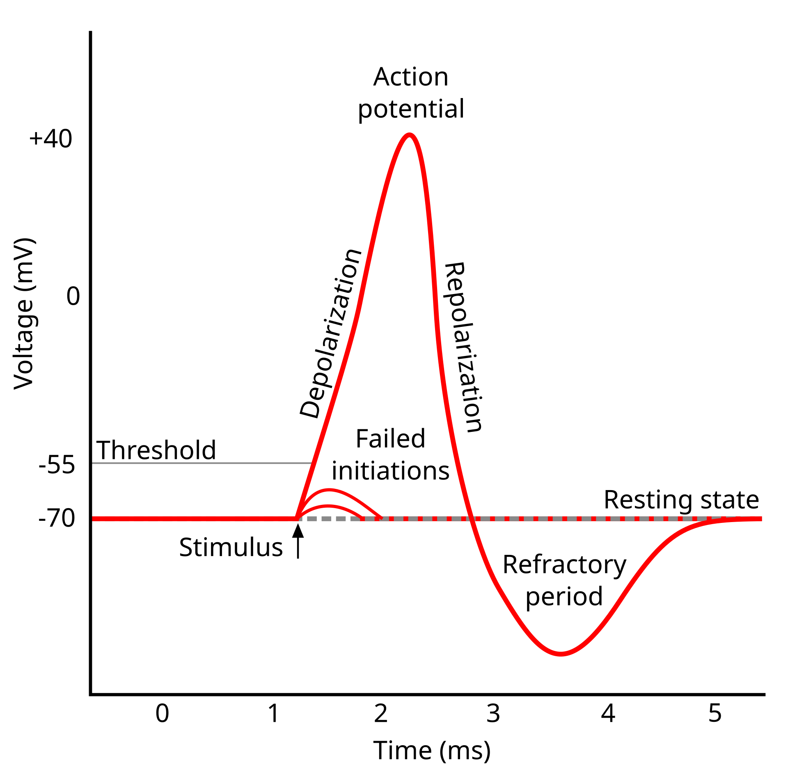
##### Voltage-clamp technique
Used by Hodgkin and Huxley, the voltage-clamp technique is used to controll the membrane potential, that is the "real" membrane signal can be **read as the amount of error signal** which 
can then be inverted to find the membrane potential
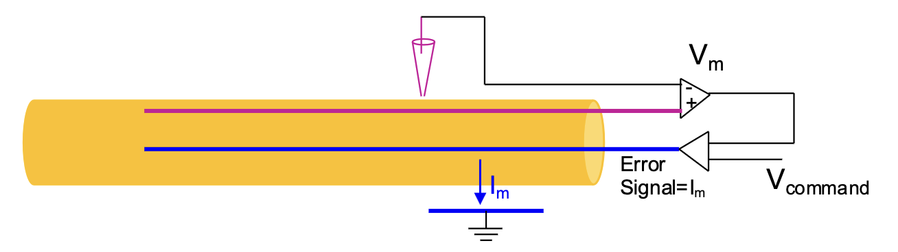
Using voltage-clamp and varying the concentration of different ions in the extracellular fluid, they found that $Na^+$ is responsible for the depolarization (positive wave) of the action potential.
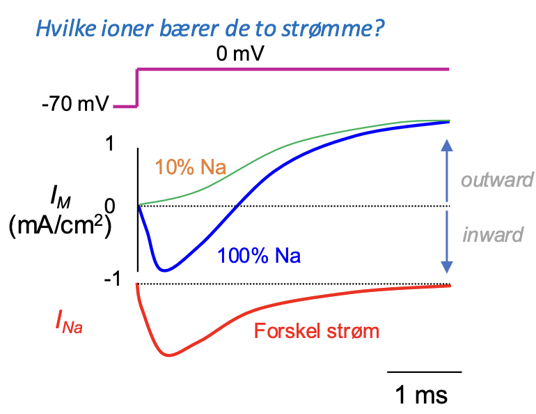
By ohms law, they could calculate the conductance of each of the ions:
$$g_{}=x\frac{I_{x}}{V-E_{x}}$$
This revealed the time series of the two voltage-gated channels:

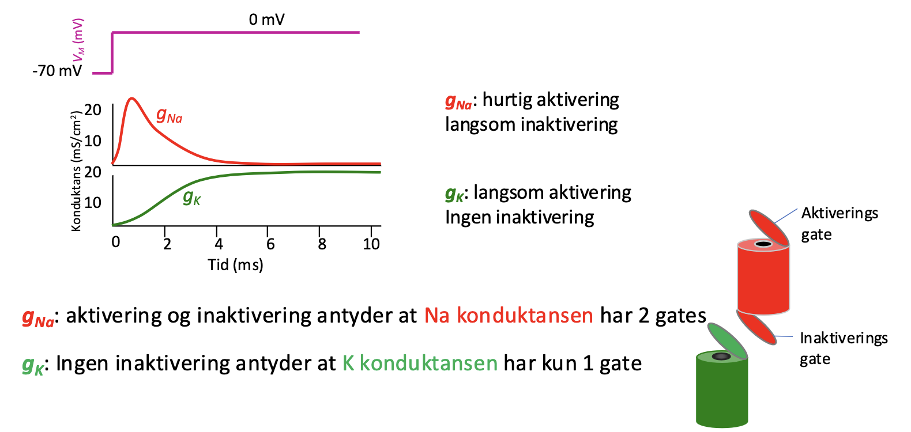
**Today** we know the precise structure of the channels

#### $Na_v$ ion channels
These proteins have **4 domains of 6 transmembrane segments**, the $\alpha$-subunit being responsible for both voltage sensitivity and ion specificity
- The S4 subunit consisting og **positively charged arginine** (and lysine) is being **pushed in place by the electrical field** of the largely negative membrane potential (-70 mV). When the membrane depolarizes, **the field weakens and the $\alpha$-helix slides outwards** - mechanically opening the gate
- After opening, there is a timing-controlled **inactivation gate**, which stop the influx of $Na^+$, and which is **kept closed until the end of the absolute refractory period (1-2 ms)**
- The **selectivity filter** is a narrow region by the extracellular end of the pore, which only lets specific ions pass based on
	- Size
	- Charge
	- Dehydration energy (energy for separating the ion from water)
	- Binding energy to the lining of the pore

The functionality of these can be investigated with **patch clamp techniques**:
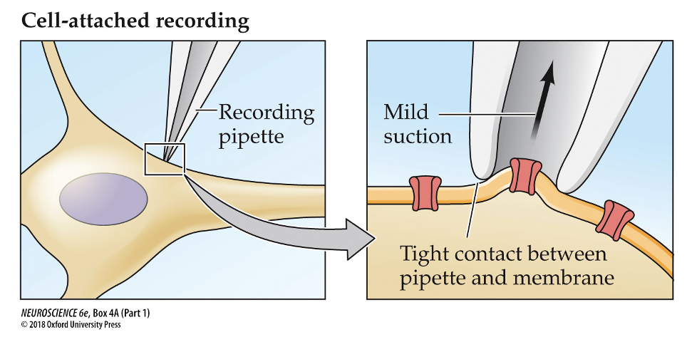
Here vi create a local constant positive membrane potential activating the channels:

When stimulating single channels, we see that the activation is not deterministic but stocastic. This however is not noticeable on average. This does mean though, that a small amount of channels will open at a lower membrane potential, creating a **positive feedback loop**, that **depolarizes the membrane and thus opens more channels**.
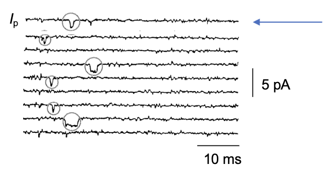

When controlling the membrane potential, we see that from $-50mV$ to $-30mV$ we see
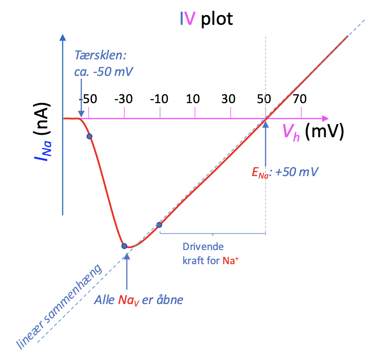

#### $K^+$ channels (Delayed Rectifier)
Just like the $Na^+$ these proteins have multiple subunits, the $\alpha$-subunit being responsible for both voltage sensitivity and ion specificity
- The S4 subunit consisting og **positively charged arginine** (and lysine) is being **pushed in place by the electrical field** of the largely negative membrane potential (-70 mV). When the membrane depolarizes, **the field weakens and the $\alpha$-helix slides outwards** - mechanically opening the gate
- The **selectivity filter** is a narrow region by the extracellular end of the pore, which only lets specific ions pass based on
	- Size
	- Charge
	- Dehydration energy (energy for separating the ion from water)
	- Binding energy to the lining of the pore
Unlike $Na^+$ channels, these have a delay in activation, but no inactivation, 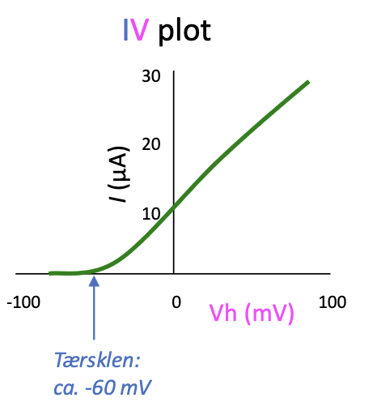

#### The action potential
When creating a constant current of a certain size ($\approx -50mV$) we reach the threshold, which activates the $Na^+$ channels, **allowing $Na^+$ to move down its electrochemical gradient**, which creates a very fast depolarization of the membrane. Meanwhile, the $K^+$ channels begins to open, while the $Na^+$ channels becomes inactive, allowing for an efflux of $K^+$ which creates a fast repolarization, and hyperpolarization, before these channels are closed and the membrane repolarizes. 
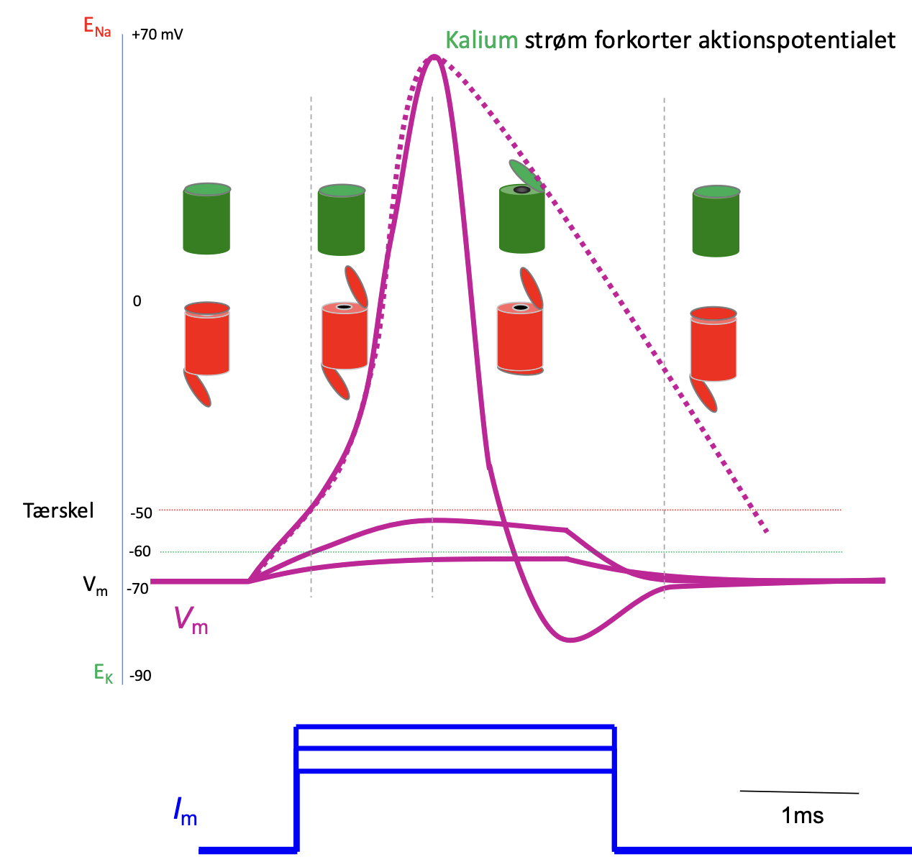

The below timeline shows the conductance of $Na^+$ and $K^+$ over time.
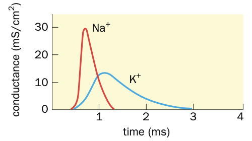
In order to reach to threshold, **multiple subliminal stimulations** can be necessary. Given the **capacitory properties** of the membrane, the potential is not repolarized instantaneously, which means that a temporally close stimuli, will depolarize even more, resulting in **subliminal summation**, which can reach a threshold even though the single stimulations may not.
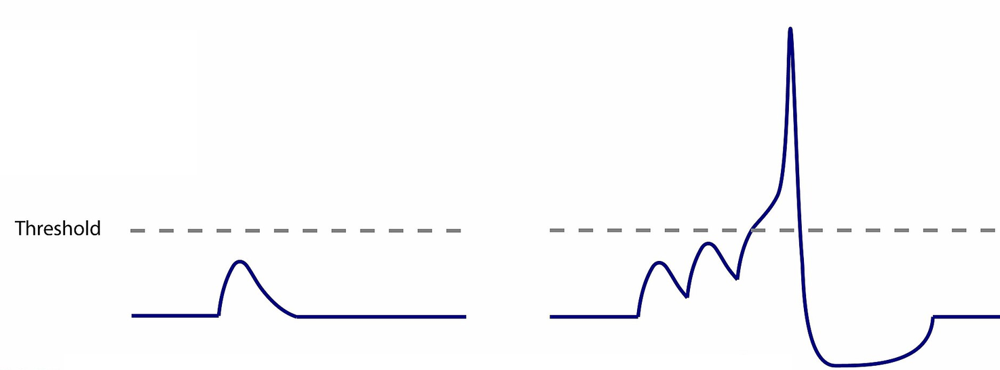
In reality, there is a lot of summation bot positive via **excitatory postsynaptic potential (EPSP)** and negative via **inhibitory postsynaptic potential (IPSP)**. 
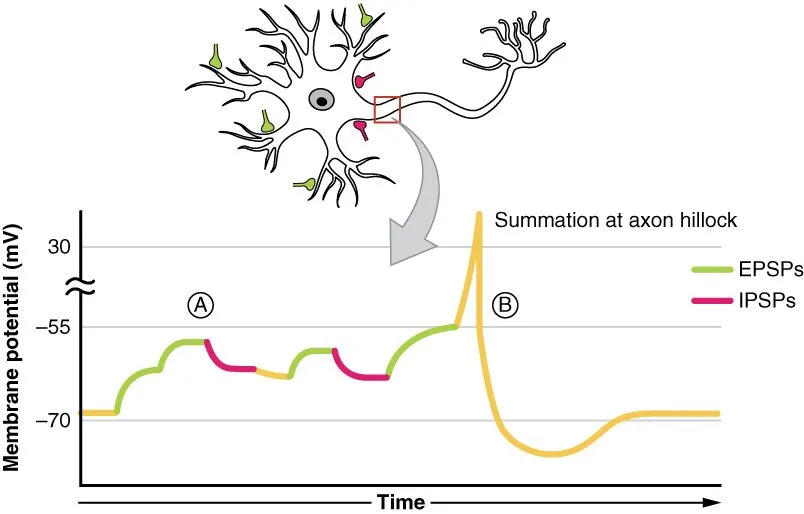

##### Refractory period
There are two parts of the refractory period
- The **absolute** refractory period (1-2 ms) is the interval where **the $Na^+$ gates are inactivated**, which means that no new action potential can take place
- The **relative** refractory period (3-4 ms) is the interval of hyperpolarization of the membrane, where an action potential **can** happen, but it requires a larger than normal stimulus.  This is a result of **hyperpolarization and partly deactivation of $Na^+$ channels.**

##### Effect of outside concentration
We have seen that a change in $[Na^+_{out}]$ has a much **lower impact** on the membrane potential the a comparable change in $[K^+_{out}]$ - This is a result of the large difference in conductance at the **resting state**.

What it does affect though is the **size of the action potential**, that is the height of the peak, as well as the **length of the depolarization interval and refractory period**
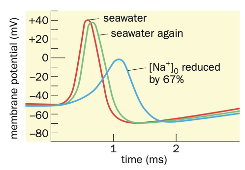
#### Propagation of the Action Potential

**Local current loops (Strømsløjfer)** are created from the influx of $Na^+$. **Intracellular** currents of $K^+$ (Because of the high concentration) spreads away from the site of activation (A), where it depolarizes the membrane across the threshold, activating the voltage-gated channels, and thus mowing the **wave front** (B).

Simultaneously the influx of $Na^+$ creates a local negative field extracellularly, so $Na^+$ flows in while $Cl^-$ flows away from the site. 

The **refractory period** as a result of the $K^+$ efflux, as well as the **inactivity  of the $Na^+$ channels** keeps the previously activated site (Z) from reaching the threshold again, and thus the action potential moves **unidirectionally**.
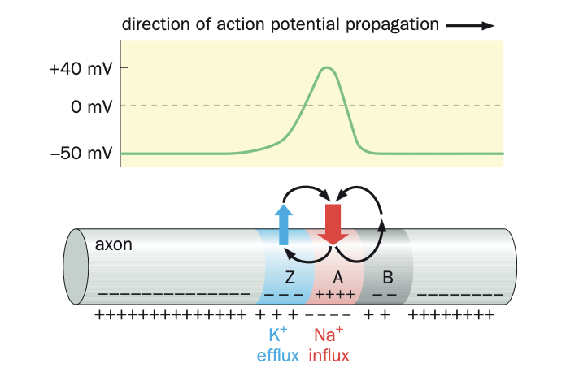
The axon initial segment has a **high concentration of voltage-gated channels**, which means that the treshold value is somewhat lower, and the axons is at its most excitable at this point, where the integration of synaptic potentials (ESPS and ISPS) takes place.

Action potentials that moves in retrograde on the axon are called **antidromic spikes** and they only happen experimentally. 

Local current flow (Strømsløjfe)
- $Na^+$ influx
- $K^+$ moves to the away intraceullularly
- $K^+$ outflux - large behind the potential and smaller in front of the wave
- 

##### Speed of propagation
The speed of the propagation of the action potential is dependent on three parameters especially - the **membrane resistance** the **intracellular resistance** and the **capacitance of the membrane**. These affect both the length constant $\lambda$ and the time constant $\tau$. 

Both $r_m$ and $r_i$ is dependent on the **diameter** of the axon/fiber.

$$r_m=\frac{R_m}{\pi d}, r_i=\frac{4p}{\pi d^2}$$

We have the length constant defined as:
$$\lambda=\sqrt{\frac{r_m}{r_i}}=\sqrt{\frac{R_m/\pi d}{4p/\pi d^2}}=\sqrt{\frac{R_m \pi d^2}{4p\pi d}}=\sqrt{\frac{R_m d}{4p}}$$
this means the the **length constant** and thus the speed of propagation grows when the diameter grows
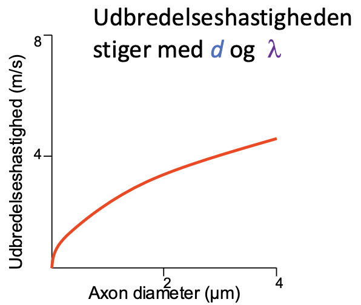

**Myelination** is another method of increasing the propagation speed. A myelinated axon is covered in layers of myelin sheets, formed by oligodendricytes in the CNS and schwann cells in the PNS. This forms in intervals, with so called **nodes of Ranvier** at every 200 $\mu m$ to 2 $mm$.
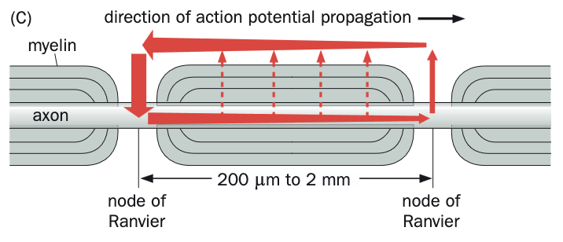
The myelin sheets changes two parameters of the membrane - the **membrane resistance**, which is greatly **increased**, and the **capacitance**, which is greatly **decreased**. This affects both time time constant and the length constant. 

The **time constant**, which describes the time it takes to charge the membrane, is defined by $\tau=R_m C_m$, which means, that it **stays the same or decreases**, as the change in resistance and capacitance **cancel each other out** (The decrease in capacitance is actually greater than the increase in resistance). 

The length constant on the other hand is only dependent on the membrane resistance (as the intracellular resistance is constant), and is thus increased proportionally (not linear) the the increased membrane resistance. 
$$\lambda=\sqrt{\frac{r_m}{r_i}}=\sqrt{\frac{R_m d}{4p}}$$
The **nodes of Ranvier** play an important role, as there is still **small amounts of current leaking**, which means that the recurring "renewals" of the action potential at the nodes allows the potential to jump from node to node called **saltatory conduction**.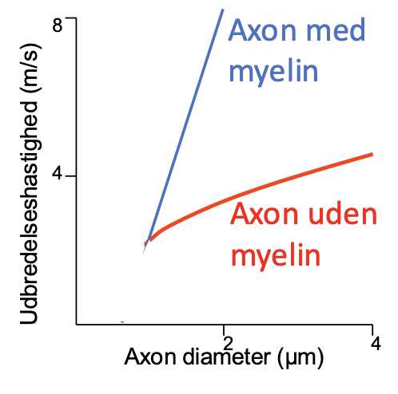

#### The $K^+$-concentration and excitibility
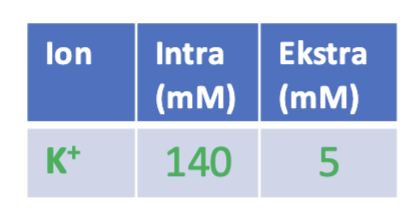
If their is a moderate **increase** in $[K^+]_e$, the equilibrium potential of $K^+$ increase
- This also means that membrane potential increases, which makes the nerve more excitable
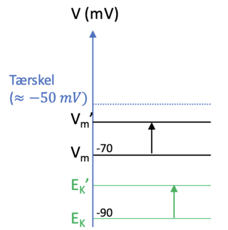
**Hyperkaliæmi** is when $[K^+]_e>5.5mM$ (Normaly it is (4-5))
- This can happen by decreases (nyre) function, and organ damage in general
- Symptoms include increases heart-rate and weakness of muscles

If the membrane potial rises above the threshold (-50 mV) then the hyperpolarization never happens, and the **$Na_v$ channels are forever inactivated**, resulting in death and stiff

f their is a moderate **decrease** in $[K^+]_e$, the equilibrium potential of $K^+$ decreases and the membrane is **hyperpolarized**

**Hyperkaliæmi** is when $[K^+]_e<3.5mM$ (Normaly it is (4-5))
- Caused by hunger (anorexia, keto diets, etc.), ireggular high level of aldostrerone

#### The $Ca^{2+}$-concentration and excitibility
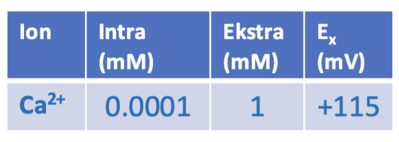
Divalent (+2 charge) kations ($Ca^{2+}$ and $Mg^{2+}$) has an effect of the excitability
- **Increased** concentrations of divalent cations extracellularly - the **excitability decreases**
- **Decreased** concentrations of divalent cations extracellularly - the **excitability increases**
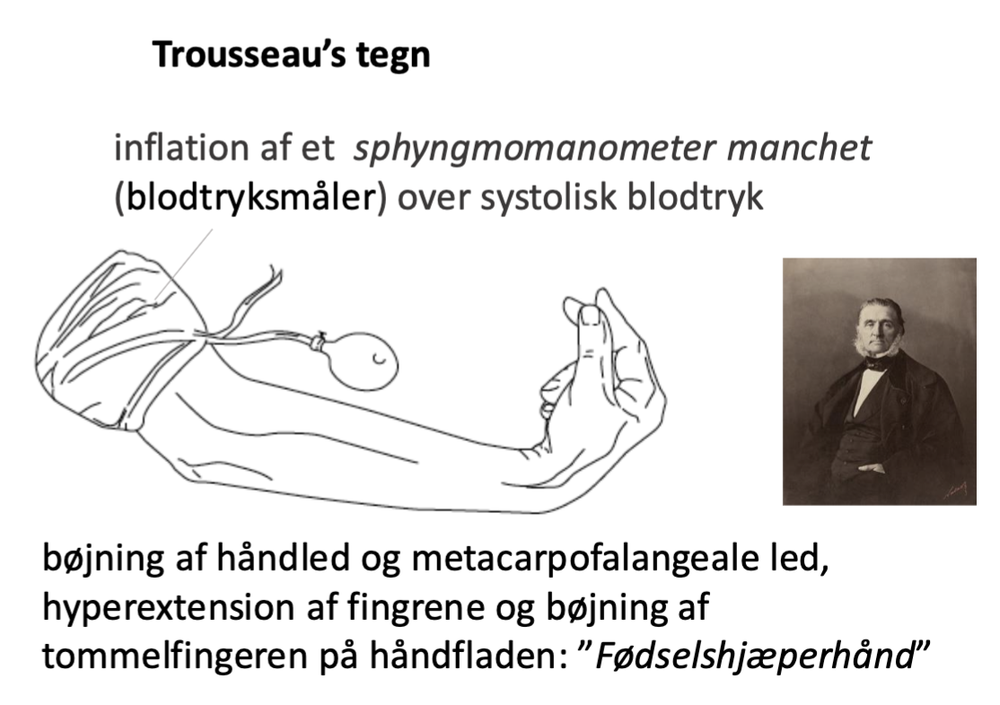

**Non of the explanations are curriculum!**

**Explanation 1**
The membrane is coated by negative ions normally but calcium ions 
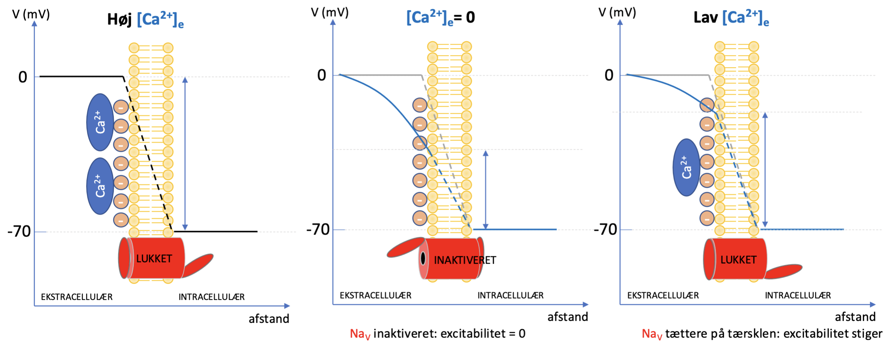

**Explanation 2**
**CALHM1** (Calcium homeostasis modulator 1) are voltage- calcium dependent cation-channels permeable to $Na^+$ and $Ca^{2+}$.
- Calcium is important because of these
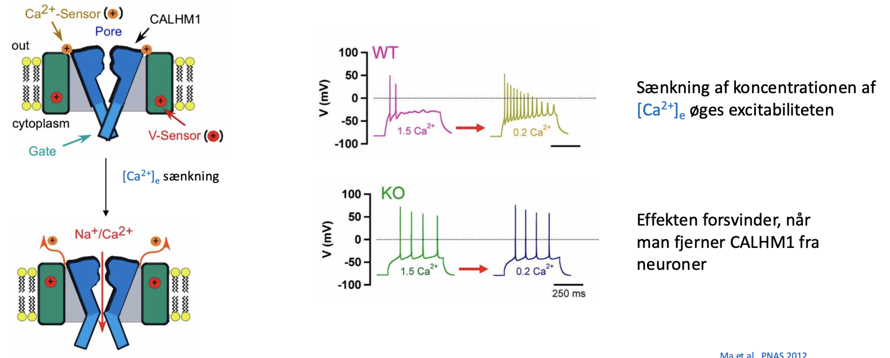

#### Extracellular stimulation
One can stimulate action potentials with extracellular electrodes places **on the outside of the membrane**. These will have a **(positive) anode** and a **(negative) cathode**, which interacts differently with the membrane.
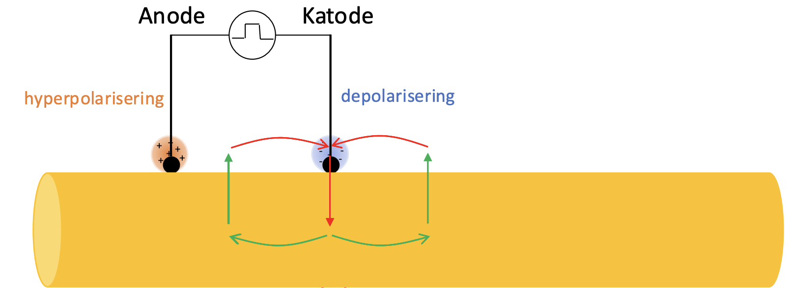

At the **cathode**, the negative field outside the membrane results in an addition of cations on the inside of the membrane, and a removal of anions on the outside - **depolarizing the cell**, and starting an action potential. 

The **anode** does the opposite, and **hyperpolarizes** the membrane.

##### Extracellular measurements
When measuring the voltage of the membrane extracellularly with a **differential amplifier**, it can be done with a reference electrode on an inactive membrane, resulting in a **monophasic action potential**. 
- The monophasic action potential often shows three waves, to small positive waves on each side of the negative wave
- This is becasue of the positivity created by the outflux of $K^+$ before and after the action potential center
- This is called a **triphasic potential**
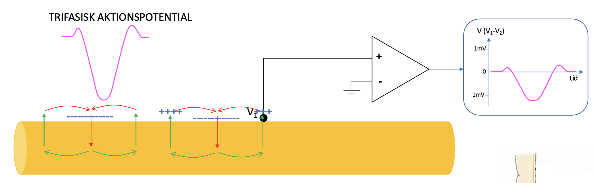
Another method is placing the two electrodes in the same fiber, resulting in a **biphasic action potential**.
- First the action potential reaches the first electrode, which means, that the extracellular negativity is measured
- The the action potential reaches the second electrode, which subtracted, resulting in a positive wave
- If the **electrodes are swapped** the waves would have an inverse shape
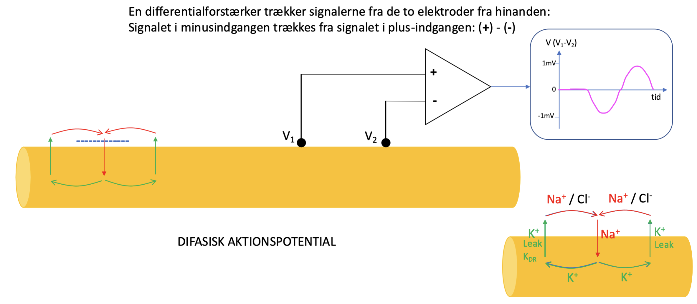

If the electrodes are close in proximity, the amplitude of the waves will be smaller, as they are subtracted from each other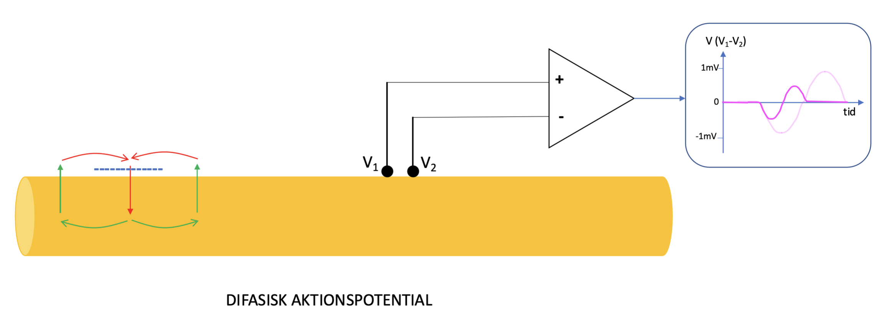If they are distance, we get a will (negative) wave, and a full (postive) wave
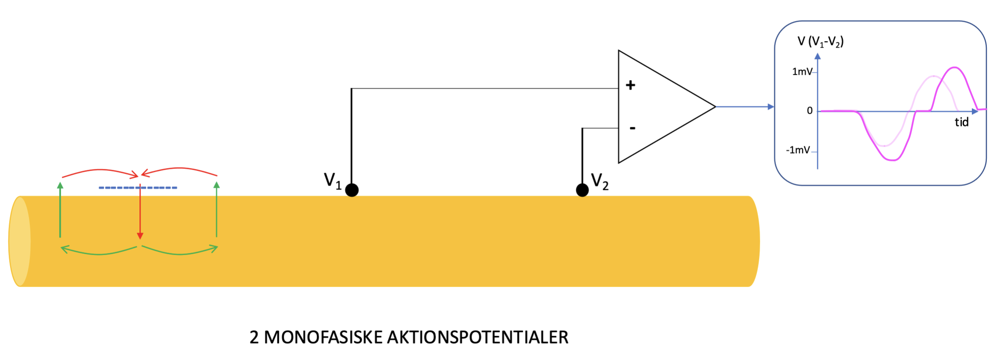

