Tags: #CellBiology 

Perspectives of **size** a cells i between virus and sand
- Virus (0.1-0.5 micro m) < Cell (15 micro m) < Sand (70 mirco m)

From one cell to a multicellular organism
- 250 types of cells
- **4 fundamental types of tissues**
	- Muscle tissue
	- Nerve tissue
	- Connective tissue (Bindevæv)
	- Epithelial tissue
### Epithelium
The epithelial tissues can be subdivided
- Surface epithelial
	- Outer
	- Inner
- Glandial epithelium (Kirtelepitel)
	- Exocrine
	- Endoxrine

**Properties and functions**
It has some general properties that makes it unique from other cells and tissues
- **Avascular** - Meaning that it has no direct blood contact
- **Polarised** - Apical (Fremad) / Basal (Base)
	- Rest on the basal lamina over connective tissues
- **Divides** cells inner/outer - Keeps out patogens and antigens and resists as mechanical stress
- Allows **directional secretion and absorption**
- Cell contacts
#### Cell contacts
Cell contacts are divided into contacts between cells and contacts between extracellular matrix and cells

The important ones to know: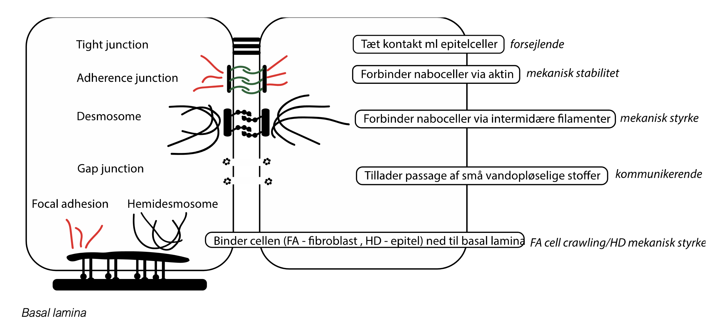

### Cell-Cell contacts
The cell-cell contacts are divided into
- **Occluding** - Forms barriers that cant be easily passed
- **Adhering** - Gives stability and structure
- **Communicating** - Intercellular communications

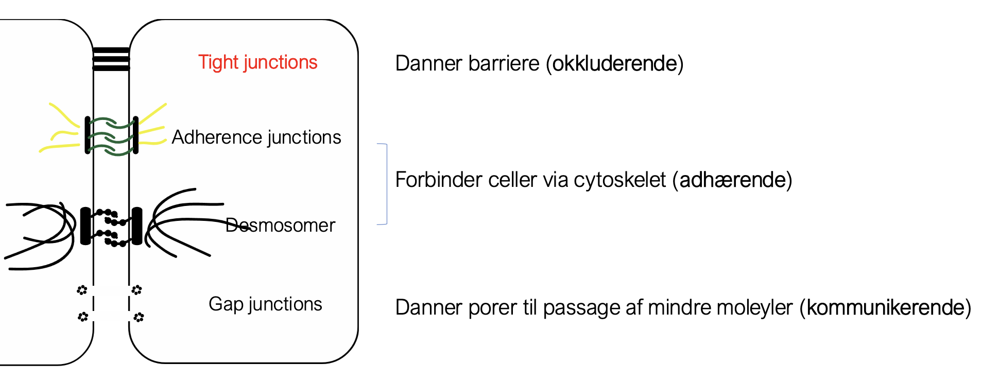
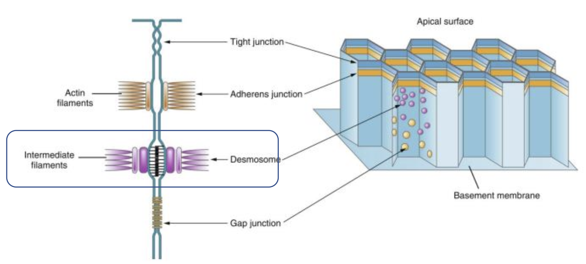
#### Tight junctions
Tight junctions **TJ** are complete belts surrounding the cell, and not just point contacts.

Transmembrane proteins - **Claudine** and **occludine** (four-pass transmembrane proteins) forms tight bonds between the cells by **homophillic interactions**  between the **extracellular domains** of the proteins
- This keeps the cells tight
- Inhibits intercellular transport between the cells of **aqua soluble** molecules
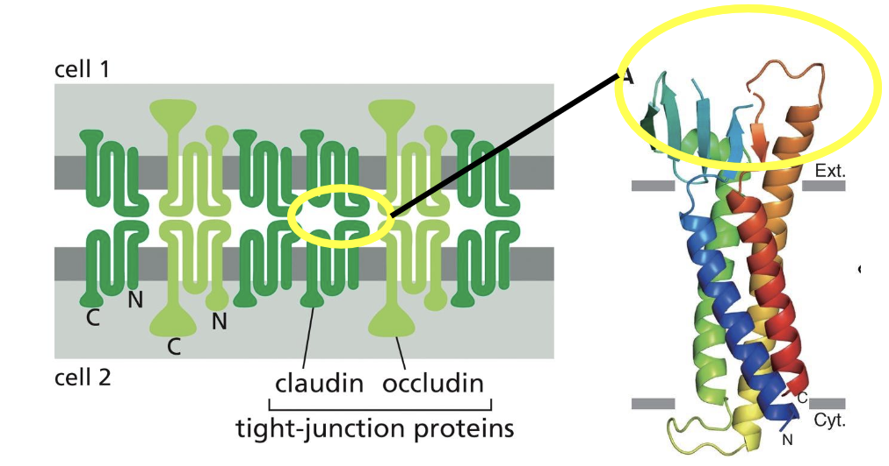

The **protein networks** connects the TJ to the cytoskeleton 
- Linking proteins (Plague protein) called **Zonula Occludens (ZO-1/2/3)** contains a mix of **domains** binding to claudin, occludin, signaling proteins, and **actin** - which fixes it **loosly** to the cytoskeleton 

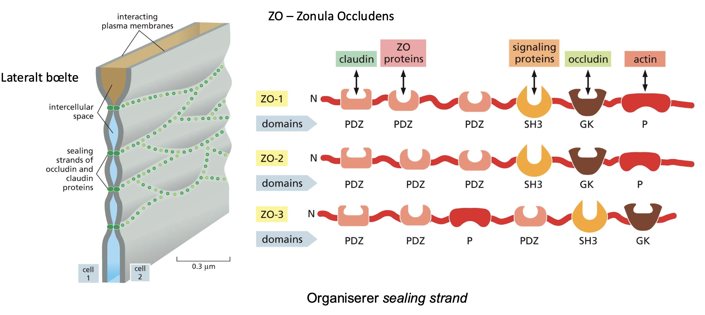
**Functions of TJ**
- It divedes the plasma membrine into the **apical** and **basal** (Basolaterale) domain
- It **inhibits lateral diffusion** of membrane proteins
- It allows **polar** nutrient **endocytosis** and **exocytosis** - transcytosis

There can occur **errors int he TJ**.
- **Claudin 1** can be defect which allows water to diffuse across the skin, which means that dehydration occurs (mice died miv)
- Lack of claudin 1 can lead to a lot of chronic inflammatory diseases (atopic dermatatis? check it out)
	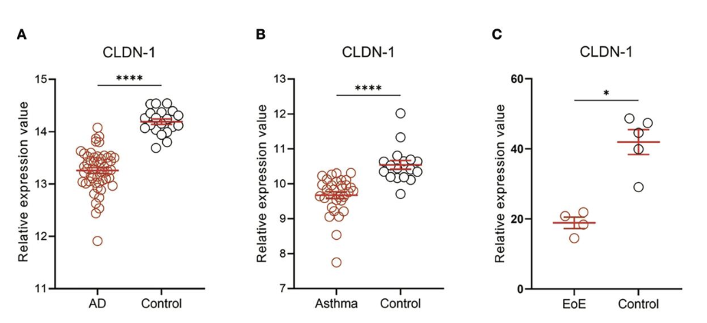

#### Adherens junctions
These **AJ** are responsible for the mechanical cobling of the cytoskeleton of neighbouring cells. This is again complete **belts** and not point contacts.
- Transmembrane **cadherin**
- The adhesion is **$Ca^{2+}$ dependent**
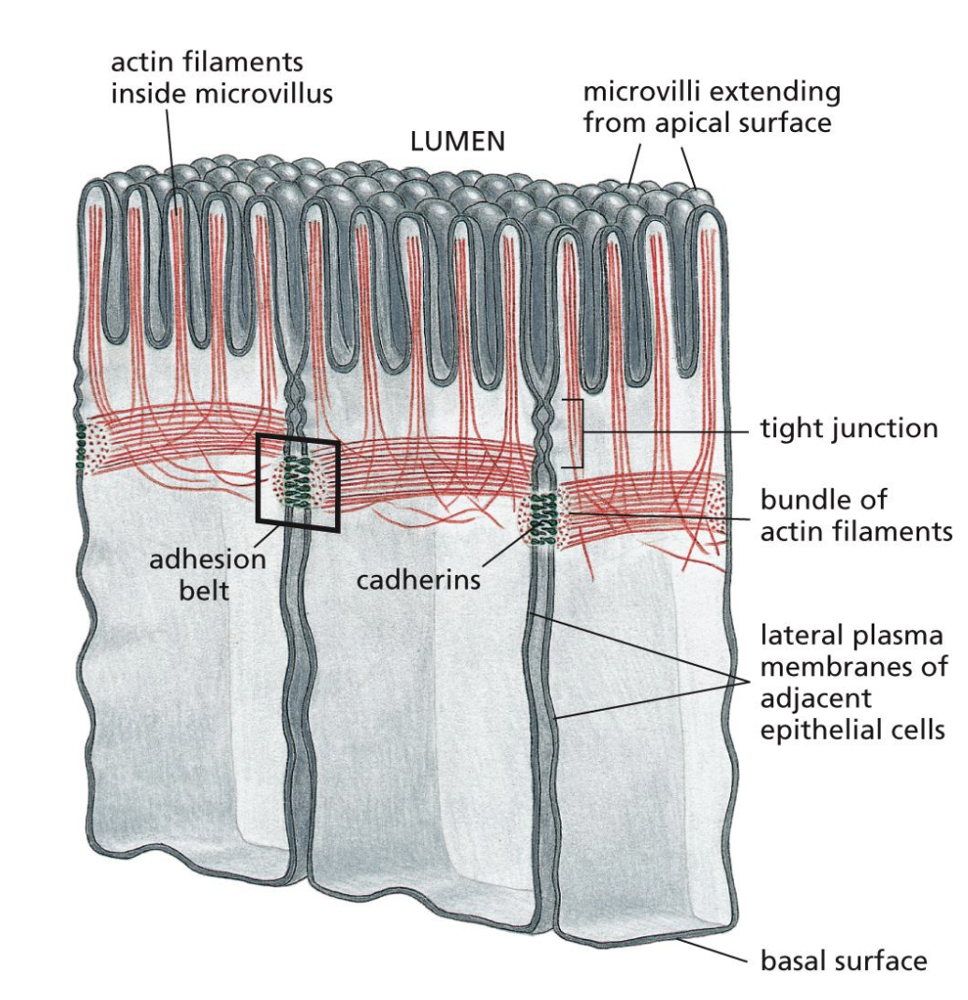

Homophillic interactions between intracellular **cadherin domains** holds the membranes close. The cadherin in turn binds to **plague proteins** (**Zonula adherens**), that binds to **actine filament**, thus connecting it to the cytoskeleton
- The binding between the cadherin is dependent on the $Ca^{2+}$ ions - these are located between the cadherins in the extracellular space

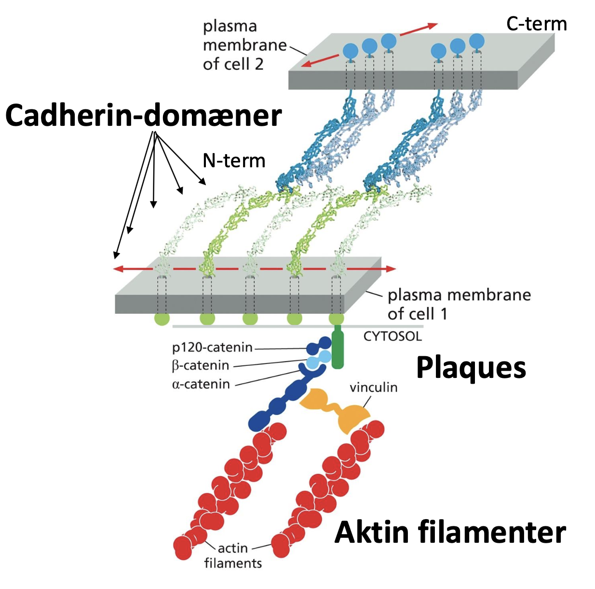

The **cadherine super family** of more then 180 types
- Allows differentiation of similar cells, which is important for different tissue types and especially **neural tubes**
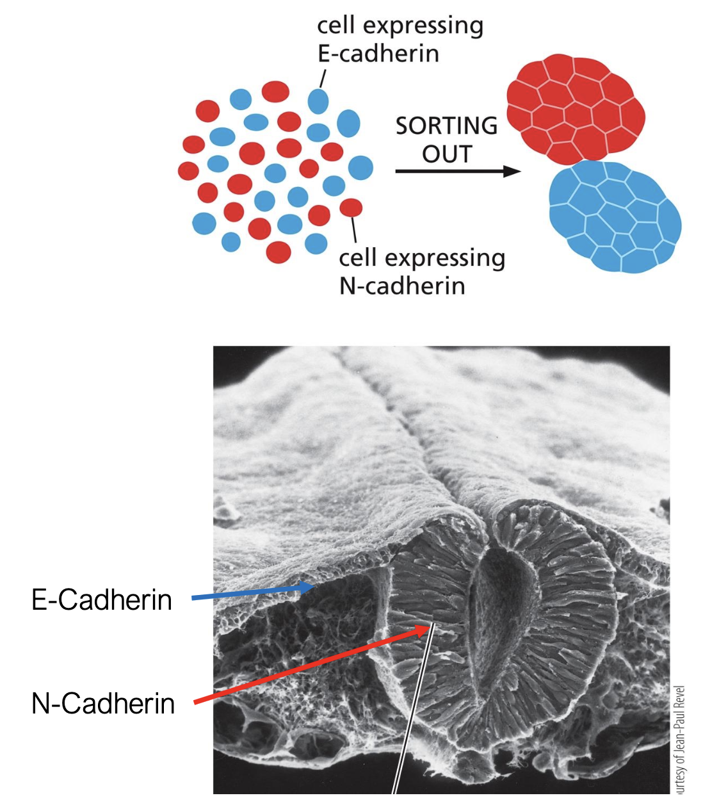

**Defects in AJ** are also prevalent 
- Defect E-cadherin in the bowels
- The cells cant form adherens junctions and desmosomer
- Disorganisted apitel with no integrity
- This results in an increase of pathogens and inflammatory bowels dieases

#### Desmosomes
The desmosomes are **point contacts** instead of complete belts 
- They are very strong (Relative to the other contacts)
- Common in cells with great mechanical stress (Epidermis and heart muscle cells)
- Non-classical **Cadherins** – Desmoglein og desmocollin (Fine to remeber cadherins)
- Binds to **intermediary filaments** (Different types dependent on cell type) trough plague proteins
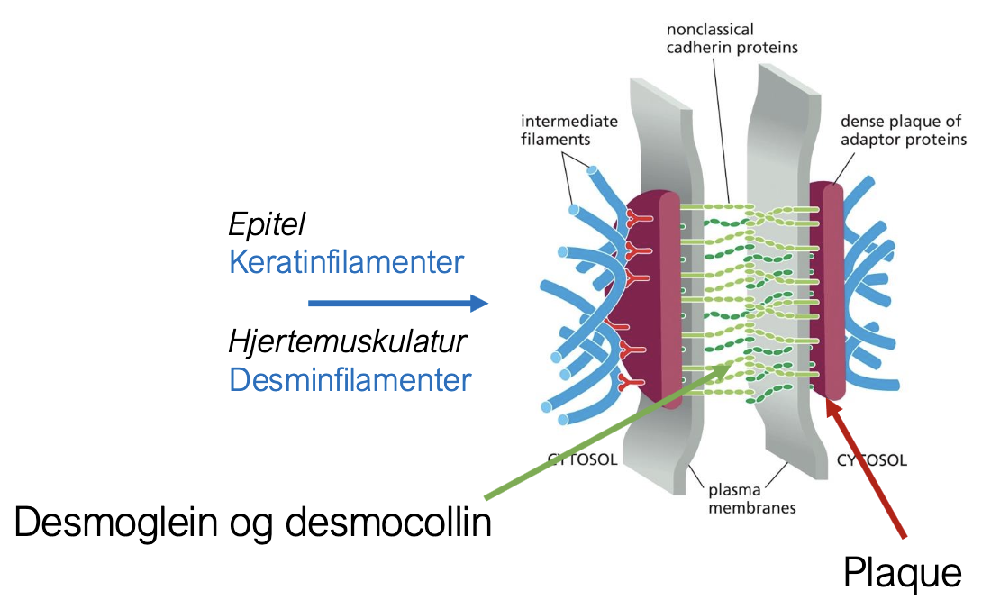

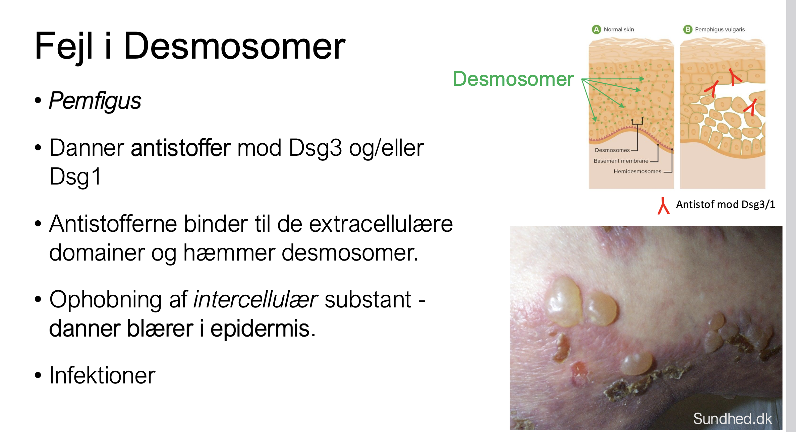

#### Epethlial-to-mesenchymal transitions (EMT)
The cell-cell contacts is important for the integrity of the epithelial cells
- Some of these are regulated (nedreguleret) during cancer, which can result in "rogue" cancer cells, that is metastases

#### Gap junctions
There is no actual contact at gap junctions, instead it is a **gap**
- Use for communications
- Channels between cell membranes
- The channels in the gap junction consists of two **halves** called **connexons**, each of which consists of **6 connexines**
	- Allows the passage of small molecules and ions (<1000da)
	- 1.4 nm in diameter
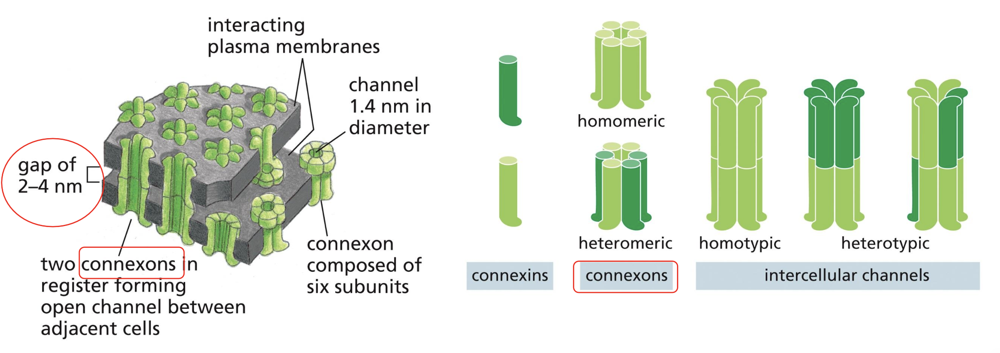

The **permeability** of the gap junctions can be **regulated** by $Ca^{2+}$ among other signal molecules.

They are very common in tissues using rapid communications, such as in **heart muscle cells**
- The gap junctions (**electrical synapses**) allow sending action potentials across the membrane directly
- Allows simultaneous contractions
- **Mutations in connexins** can lead to heart faliure and heart arrhythmia (irregular heart beat)

### Cell-ECM Contact
the extracellular matrix is a network of
- Fibrose proteins - Collagens
- **Adhesive glycoproteins** - Laminin and fibronectine
- **Proteoglycans** - Perlecan, decorin, aggrecan
- Glycosaminglycanes (**GAGs**)

It provides **mechanical strengths** and as a mechanical buffer (pillow) between cells. All cells can create the matrix, but the **compostision differs between the cells**.
- Fibroblasts - Connective tissues
- Osteoblasts - Skeletal ECM
- Chondroblasts - Cartilgae (Brusk) ECM
- Epithelial cells - **Basal lamina** ECM

The basal lamina is a specialized ECM, with
- Adhesive glycoproteins - Laminin
- Collagen IV
- Proteoglycanes
##### Adhesive glycoproteins
These are **extracellular glycoproteins** with **multiple domains**, that are specialised in binding to each other and other molecules, and thus creates a **big network (matrix)**. The glycostructures are great for mechanical buffers.

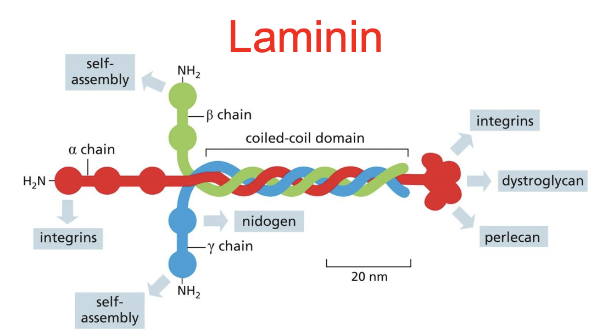

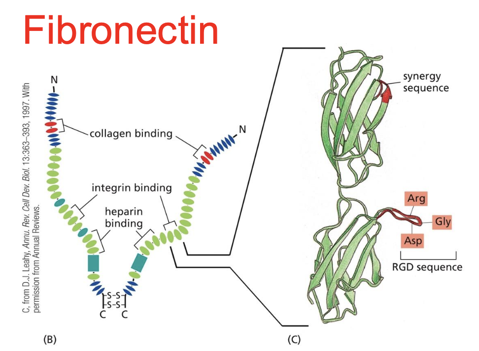

##### Proteoglycanes
Long chains of sulfating polysaccharides attached to a smaller protein
- There are more than 50 types, with great heterogeneity between sugars
- They attract water, which creates a **gel-like substance**
- They form a **matrix** with the glycoproteins and collagen
- This acts as a mechanical buffer (stødpude) while **allowing diffusion** of nutrients, metabolites and hormones
##### Collagen
Long proteins, the forms long fibers
- Creates the robe-like **super-helices** (triple helices)
- Collagen IV is characteristic for forming net like structure
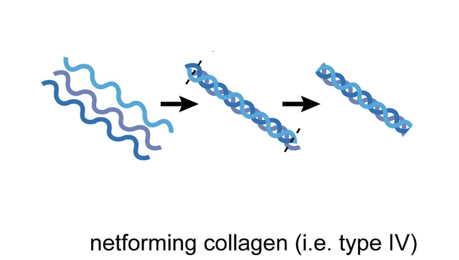

The basal lamina is thus formed by the interconnections between the criss-crossing laminin, the collagen super-helices, the proteopglycanes, and some other proteins. It forms the extracellular base of the epithelial cells, between the cells and the connective tissues. 
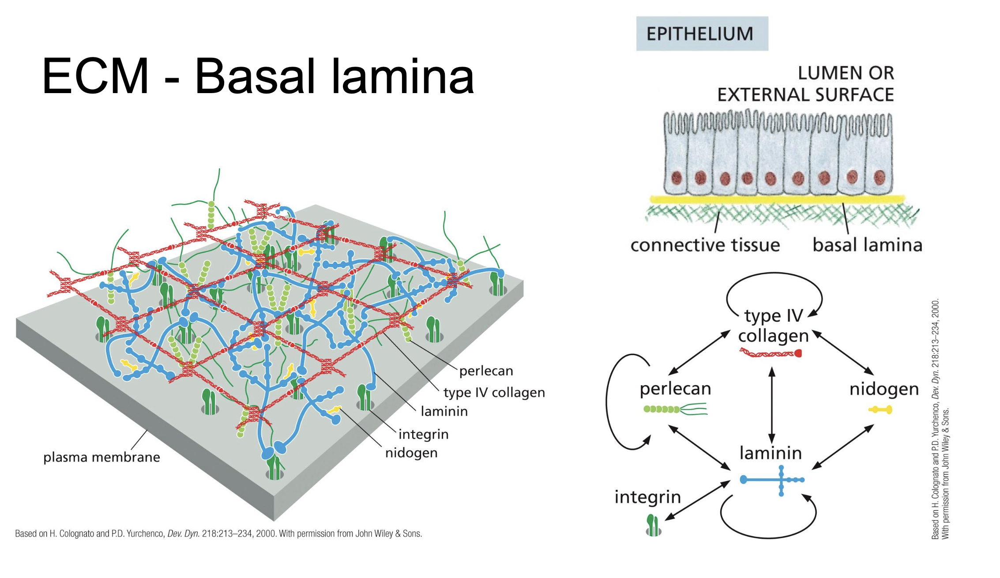
#### The Cell-ECM contact
- Intracellular we have keratine, plasma stif....

**Integrines** 
Transmembrane proteins that connects the cytoskeleton to the ECM
- Attach the cytoskeleton to the basal membrane 
- They .....
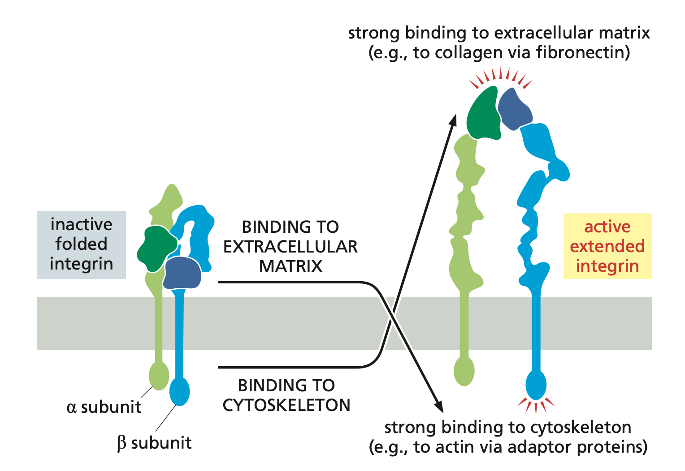

##### Hemidesmosomes
Anchors the epithelial cells to the ECM
- The binds the **keratine** (intermediary filament) via the **integrin** to the **adhesive glycoproteins** in the ECM
- It is a very strong contact
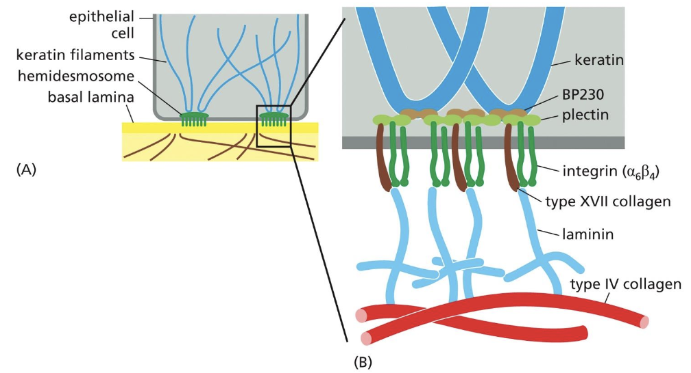
##### Focal adhesions
Common in **fibroblast cells** - see [Cytoskeleton and Protein Filaments](./cytoskeleton-and-protein-filaments.md) for details
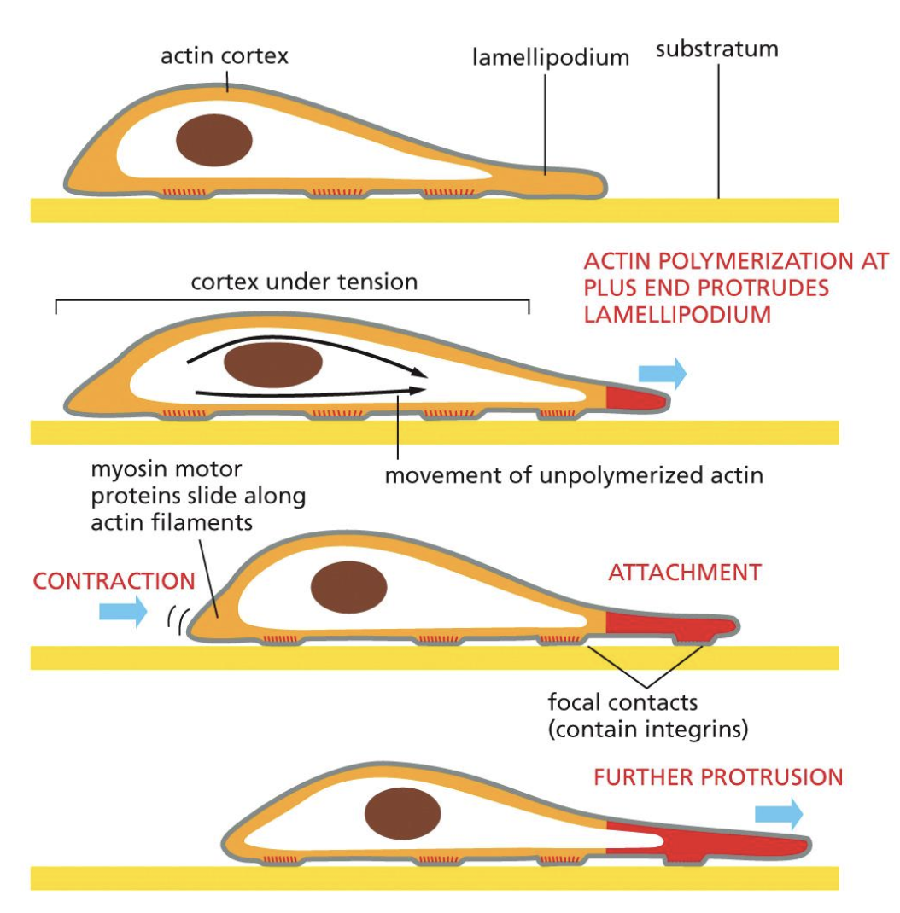

**Defects in the integrins** can have a lot of consequences depending on the type of integrin
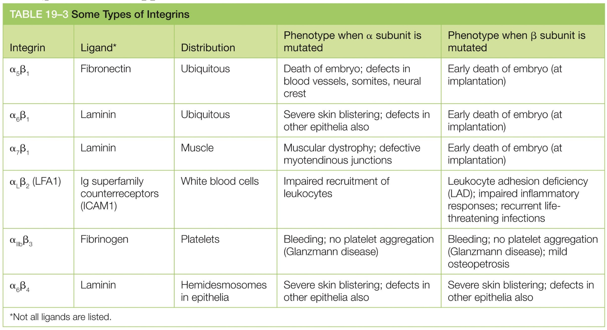

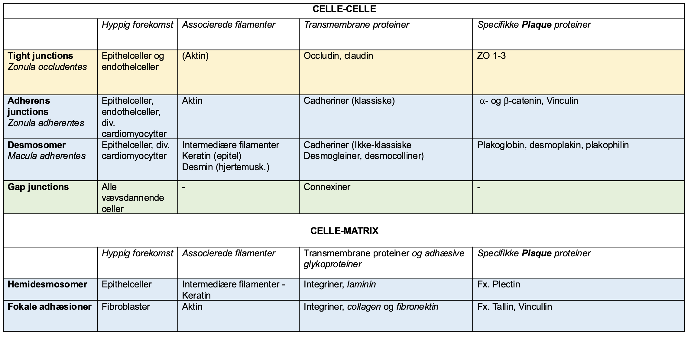