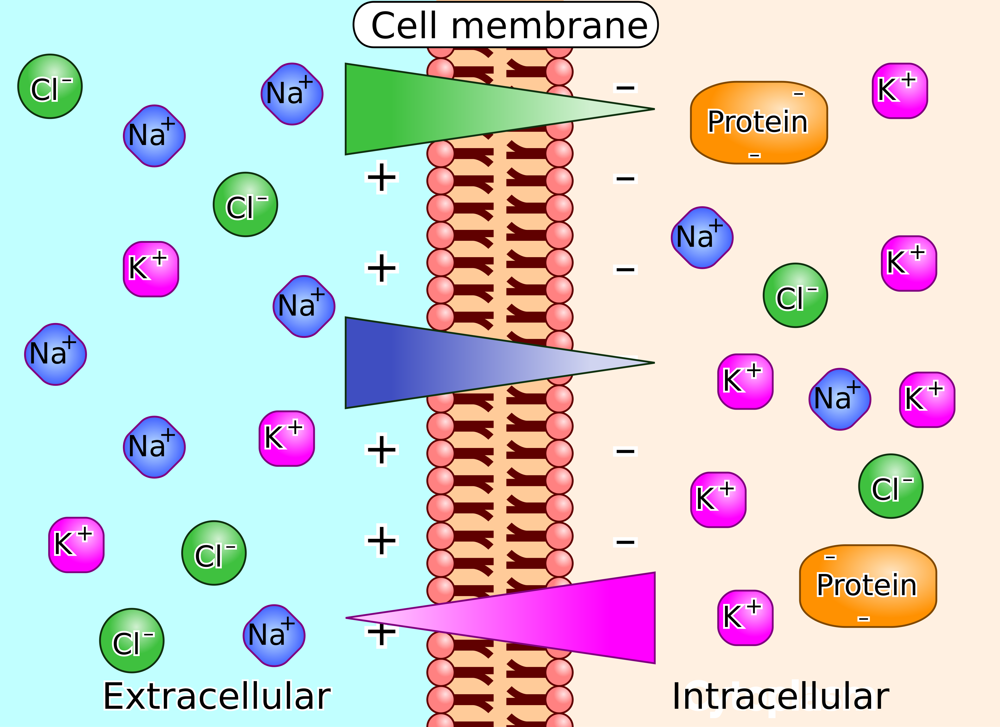
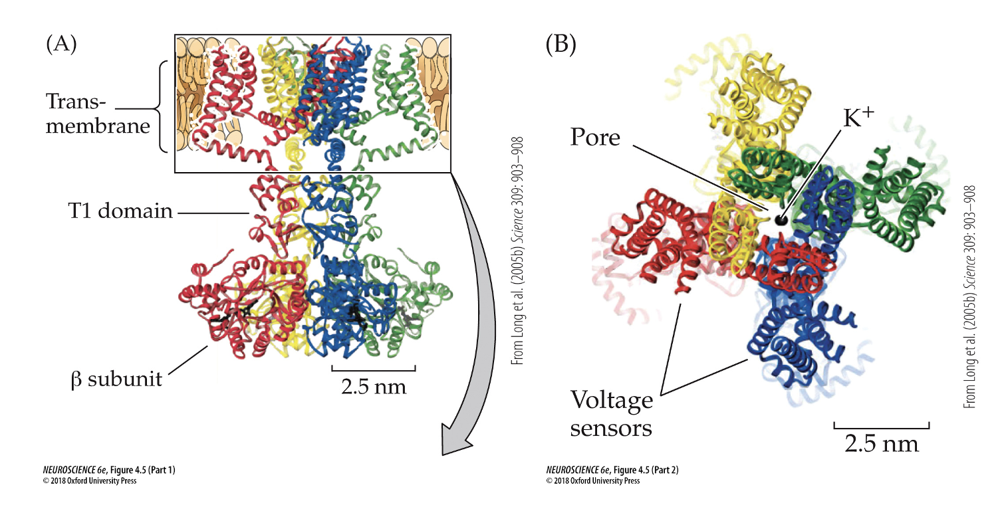
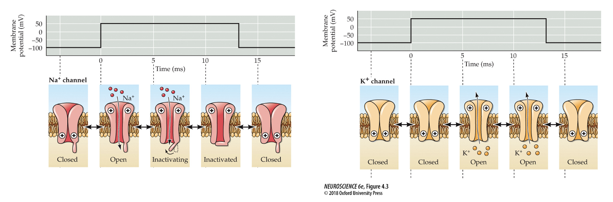
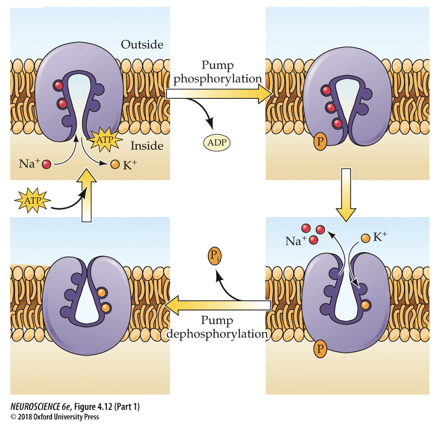
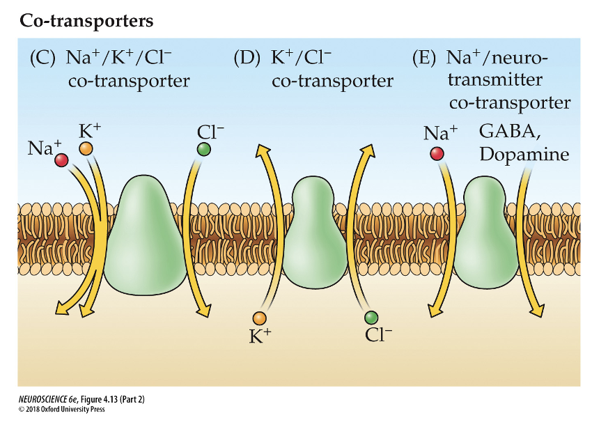
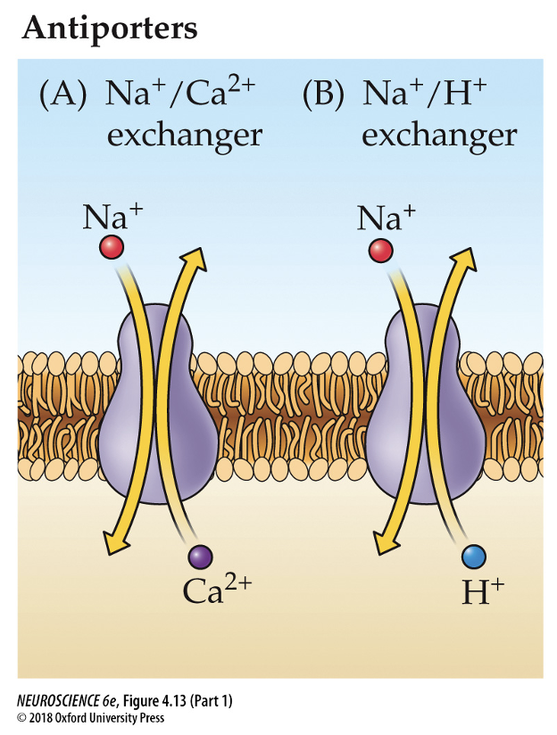

Tags: #Physiology  #Neuroscience #CellBiology #Electricity
The membrane potential is defined as the **weighted average** of the **equilibrium potential** of the **permeable ions**

Given the relatively **high permeability of $K^+$** (but not the other ions) we have a quite negative membrane potential.

Terms for change in the potential
- **Hyper-polarization** - Becomes more negative (polarized) - Also called **refractory period**
- **De-polarization** - Becomes less negative (polarized)
- **Re-polarization** - Becomes polarized after being de-polarized

#### Equilibrium Potential

The equilibrium potentials are calculateded using **Nernst equation**
$$V_{eq}=\frac{RT}{zF}\ln{\frac{c_{out}}{c_{in}}}$$
where $R$: Gas constant, $T$: Temperature, $z$: charge of ion, $F$: faraday constant

In a regular neuron at ($\approx$ 37 $C\degree$) this can be simplified to:
$$V_{eq}=\frac{61.4}{z}\log{\frac{c_{out}}{c_{in}}}$$
The only way to change the equilibrium potential of the ions is the **change the concentration**.
The typical concentration in the neuron and extracellular fluid:

| Ion       | Intracellular concentration | Extracellular concentration | Equilibirum potential (at $37 C\degree$) |
| --------- | --------------------------- | --------------------------- | ---------------------------------------- |
| $K^+$     | 140 mM                      | 5 mM                        | $-84 mV$                                 |
| $Na^+$    | 10-12 mM                    | 145 mM                      | $67mV$                                   |
| $Cl^-$    | 5-8 mM                      | 110 mM                      | $-78mV$                                  |
| $Ca^{2+}$ | 0.0001 mM                   | 1-2 mM                      |                                          |

#### Membrane Potential

We can change the membrane potential by changing the conductance (permeability) of the individual ions

Membrane potential can be calculated using
**Goldman-Higkin-Katz equation** - I bit old school, as we usually don't work with permeability
$$V_m=\frac{RT}{F}\ln{\frac{P_K [K^+_{out}]+P_{Na} [Na^+_{out}]+P_{Cl} [Cl^-_{in}]}{P_K [K^+_{in}]+P_{Na} [Na^+_{in}]+P_{Cl} [Cl^-_{out}]}}$$
**Millman equation** - More common (The weighted average)
$$V_m=\frac{\Sigma g_i E_i}{\Sigma g_i}=\frac{g_K V_K+g_{Na}V_{Na}+g_{Cl}V_{Cl}}{g_K+g_{Na}+g_{Cl}}$$
Here we use two different terms for describing the ions passage across the membrane
- **Permeability ($P_i$)** is a **membrane property** that describes the ease of an ions diffusion through a membrane.
	- Measured in $cm/s$
- **Conductance ($g_i$)** is a **functional property** that describes the ease of an ions current flow pr volt. This is dependent on the permeability and the voltage. 
	- Measured in siemens ($S=A/V$) and we have $g_i=\frac{I_i}{V_m-E_I}$, where $V_m-E_I$ is the **driving force** of the ion
Ions can have **permeability without conductance, but not vice verse**

The movement of an ion is **always** dictated by its equilibrium potential

##### Effect of outside concentrations
Given some realistic conductance values, we can calculate the effect of the outside concentration of each ion:
$g_K=0.12$, $g_{Na}=0.01$, $g_{Cl}=0.01$

| Ion kocentration                | Equilibirum potential | Membrane potential |
| ------------------------------- | --------------------- | ------------------ |
| $[Na^+_{out}]=145 mM$ (Normal)  | $\approx67 mV$        | $\approx -73 mV$   |
| $[Na^+_{out}]=10 mM$ (Abnormal) | $\approx-5mV$         | $\approx -83 mV$   |
| $[K^+_{out}]=5 mM$ (Normal)     | $\approx -90 mV$      | $\approx - 73 mV$  |
| $[K^+_{out}]=50 mM$ (Abnormal)  | $\approx -28 mV$      | $\approx-24mV$     |

We see that a change in $[Na^+_{out}]$ has a much **lower impact** on the membrane potential the a comparable change in $[K^+_{out}]$ - This is a result of the large difference in conductance at the **resting state**.

### Membrane proteins

##### Channels
**All cells have a membrane potential,** but only some (Neurons and muscle cells) have the voltage-gated proteins necessary for action potentials.

These proteins have multiple subunits, the $\alpha$-subunit being responsible for both voltage sensitivity and ion specificity
- The S4 subunit consisting og **positively charged arginine** (and lysine) is being **pushed in place by the electrical field** of the largely negative membrane potential (-70 mV). When the membrane depolarizes, **the field weakens and the $\alpha$-helix slides outwards** - mechanically opening the gate
- The **selectivity filter** is a narrow region by the extracellular end of the pore, which only lets specific ions pass based on
	- Size
	- Charge
	- Dehydration energy (energy for separating the ion from water)
	- Binding energy to the lining of the pore

Types of channels: 

| Channel type | Role                                          | Activation threshold | Timing                                | Location |
| ------------ | --------------------------------------------- | -------------------- | ------------------------------------- | -------- |
| $Na^+$       | Depolarization - Action potential             | -55 to -40 mV        | Fast to open - inactive shortly after | Neuron   |
| $K^+$        | Repolarization / Hyperpolarization            | -70 to +20 mV        | Slow to open - no inactivation        | Neuron   |
| $Ca^{2+}$    | Neurotransmitter release / Muscle contraction | -40 to +20 mV        | Varies                                | Synapses |

The functionality of these can be investigated with **patch clamp techniques**:

Here vi create a local constant positive membrane potential activating the channels:

For the **potassium canal** we see a slow opening time, but for a long period time
For the **sodium canal** we see the opposite: a fast opening, but for a short interval of time.

Other **non-voltage dependent channels**:
- **Mechanosensitive** channels - Which responds to mechanical force on the cell. They are usually **cation selective** or **anion selective**.
- **Ligand controlled** channels such as
	- $Ca^{2+}$-activated $K^+$ channels in the synapses
	- **cyclic nucleotide** (cGMP and cAMP) gated channel
	- **Neurotransmitter receptors** - these are u

Some neurotransmitter receptors are **non-selective cation channels** - How do we then determine the ion flux (of $K^+$ and $Na^+$)?
- The **reversal potential** is the membrane potential where there is **no net current flow**
- Above this the net sum current flows outwards, while it flows inwards below.

#### Transporters
When transporting ions inverse to its electrochemical gradient, we need energy.
This is done using **pumps** and **coupled transporters**

**Sodium-Potassium Pump** ($Na^+/K^+$-ATPasen) creates the $Na^+$ and $K^+$ gradients
- It uses $\approx 50\%$ of the energy of the brain
- When 3 sodium binds to the protein, it changes the conformation given the electrical charge
- This allows the sodium to be released and 2 potassium to bind
- The protein is then dephosphorilized
- Læs mere op på det!

**Co-tranporters**
Coupled transporters moves molecules (not just ions) **against their gradients** via the coupled molecules being moved towards their gradient

This is used for
- Capture of nutrients
- Release of metabolites
- Recapture of neurotransmitters

The co-transport can be a **symporter** if the molecules moves in the same direction
- An example is the **$Na^+$-coupled serotonin transporter**, which drives the **recapture** of serotonin by a simultaneous intake of $Na^+$. 
- Antidepressants block this transporter, keeping the serotonin in the synaptic cleft.

The co-transporters can also be **antiporters**, where they first move an ion towards its gradient, and afterwards an ion **against** its gradient 

