Tags: #CellBiology #Energy 

#### Morphology of the Mitochondria
The mitochondria is one of the few **double-membrane** organels of the cell.
- The outer membrane is covered by **porin proteins** making it permeable to molecules up to $5000$ dalton, as well as having specific **transport proteins**
- The inner membrane hosts the **electron-transport chain** and the **ATP synthesis**. It is highly **convoluted** forming **cristae** (infolds), which increases the surface area.
	- Its very **impermeable** due to the lipid **cardiolipin** in the membrane
- The **matrix** is the inner compartment with the **mitochondrial DNA**, and hundreds of enzymes for **pyruvate** oxidation, **fatty acid** oxydation, **citric acid cycle** and much more. 
	- This also contains the mDNA
- The **intermembrane space** contains proteins for phosphorylating nucletides (using ATP), important for the hydrogen gradient, and some **pro-apoptotic factors** (proteins for apoptosis)

The mitochondria diffuses freely in some cells, while in others, it forms structures to supply ATP to areas of high energy consumption.
- In cardiac (heart) muscles, they form layers between the **myofibril** (contraction proteins)
- In sperm they surround the **flagella** (motor protein)
- In some cells they form **elongated tubular networks**

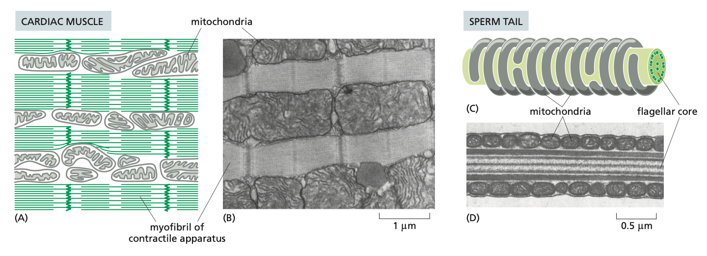
##### Mitochondrial DNA (mtDNA)
The mitochondria have their own **mitochondrial DNA**. This is **100% from the egg cell** (mother), which has about 100.000 mitochondria, while the spermatoze has about 1000 mitochondria, that are marked by ubiquitin and later destroyed. (**Maternal arvegang** in danish)
- It has 16,569 nucleotide pairs
- 37 genes coding **exclusively** for the electron transport chain (making up for about 4% of the proteins in the mitochondria)

The mitochondrial DNA exists in **many copies**, with **no histones**, **no introns** and a very simple DNA repair system.
- This means that every mutation in the mitochondrial DNA is expressed in some proteins. 
- It also means, that most of the damaged mtDNA copies are destroyed (because of the damage) and thus cant be passed on

**Heteroplasmia** is defined by having different types of mtDNA in the same tissue while **homoplamsmia** is defined as having the same mtDNA in all tissue. This describes both **mutations** and **polymorphias**

It is **completely random** which the mitochondria is given to which cell at division, which means that we can end with some cells with mitochondrial diseases, and some without - **mitochondrial segregation**. This variability is called **variabel expressivity**
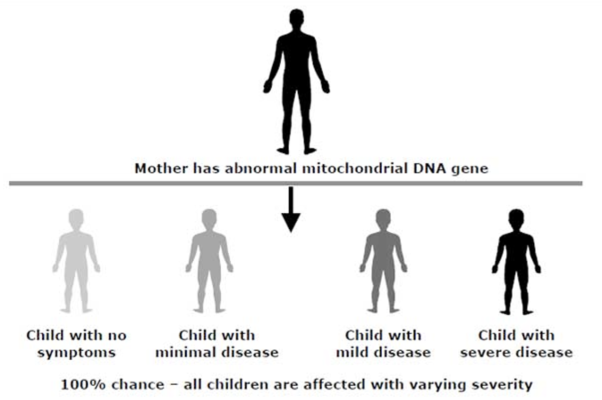

##### Functionality of mitochondria
The mitochindria have more roles in the cell, than just ATP synthesis:
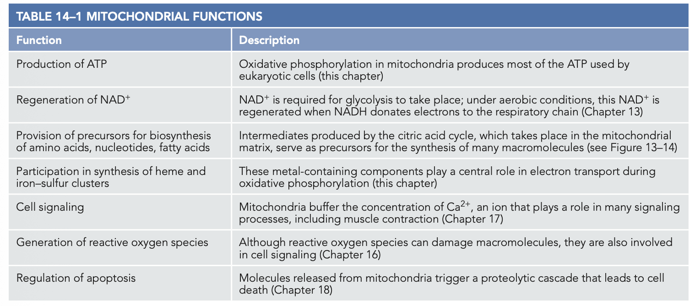

Simply put, the mitochondrial function can be broken down into multiple steps
- **Citric Acid Cycle**
- **Electron Transport Chain**
- **Chemiosmosis**
The last two are what we call **oxidative phosphorylation**
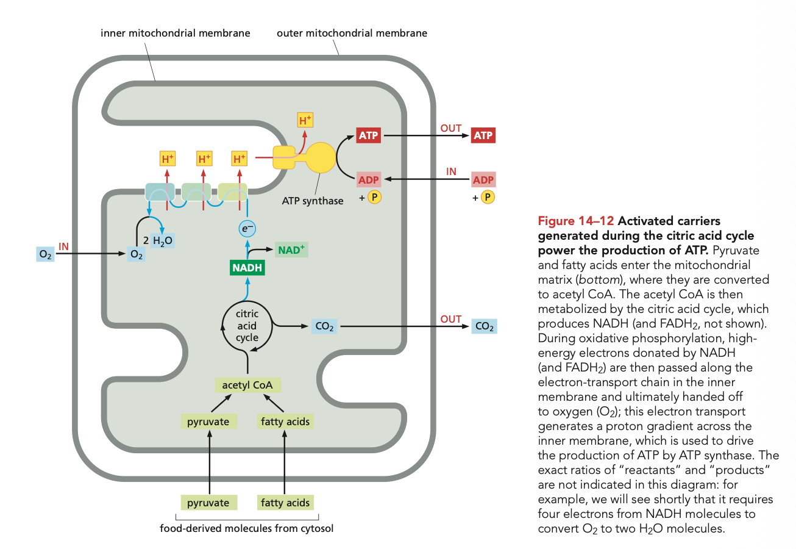

##### Mitochondrial division (and fusion)
The mitochondria can like whole cells split using **fission**. This is done using **dynamine** to divide the membranes (just a membrane vesicles). The mtDNA is stocastically divided, and can be uneven in numbers. 

We can have a too large amount of mitochondria in a given cell. These can be fused together using membrane proteins

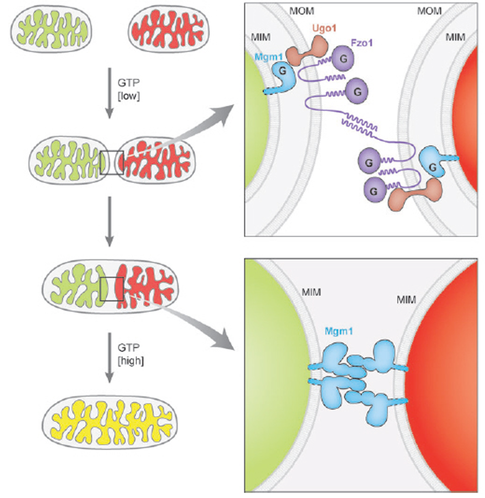
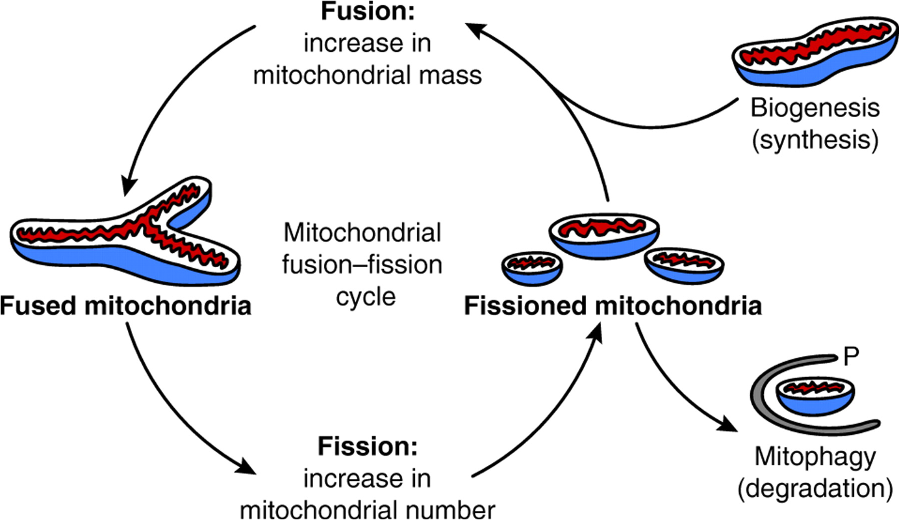

#### Evolution of Mitochondria
The mitochondria in the cell is a evolutionary result of symbiosis between an early eukaryote cell and an early bacteria - **curriculum** is four arguments why
1. Supported by the double membrane (One would be the bacterial membrane, and the other the endocytosis membrane)
2. Supported by mitochondrial DNA
3. Cardiolipin in the inner membrane - this is usually found in bacteria
4. The ability to do fusion and fission unlike other organelles

#### Protein Translocation and Assembly
See [Compartments and Protein Distribution](./compartments-and-protein-distribution.md)
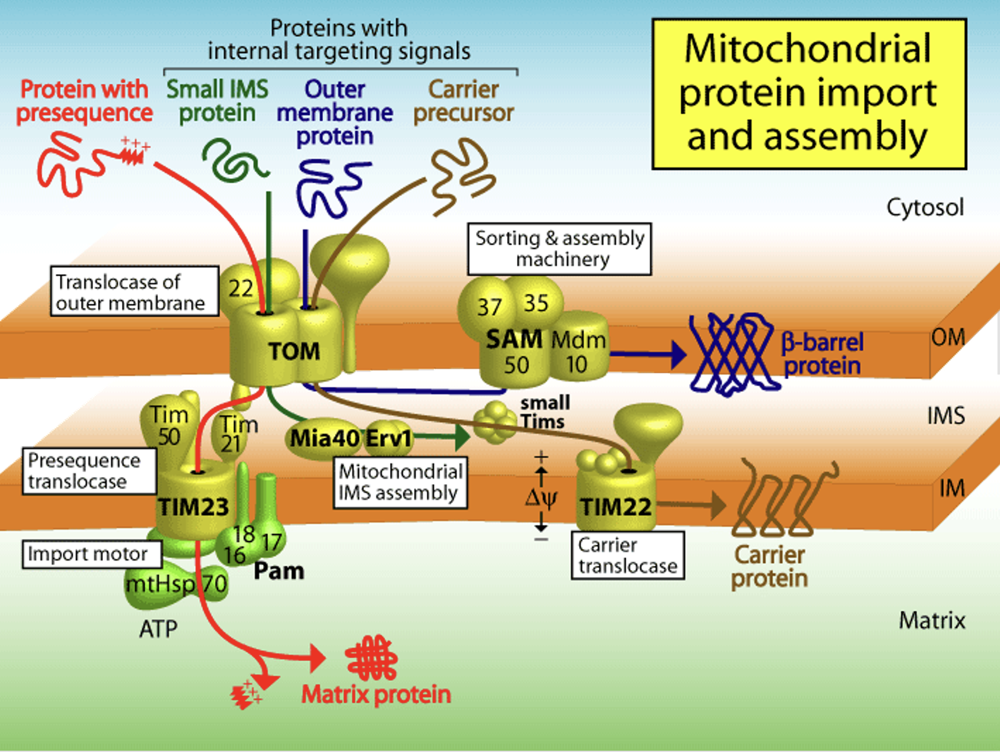

#### Glycolysis and Transport
In the **cytosol** sugars are cleaved to **glucose**, which is transformed to **pyruvate** by **glycolysis**:
	Glycolysis is important because it is a **much faster reaction**, than oxidative phosphorylation, which is why **anaerobe** respiration is faster then **aerobe** respiration
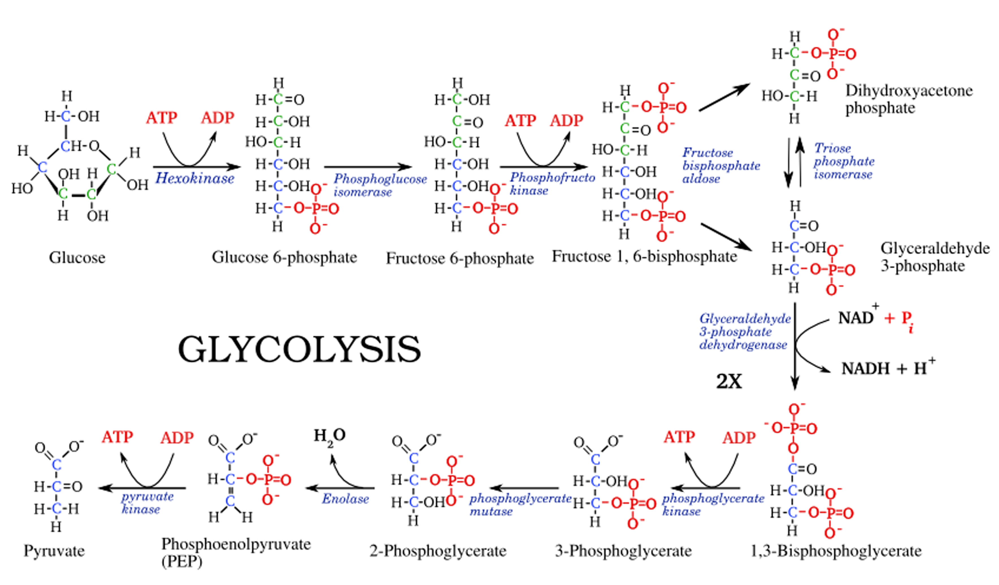

Pyruvate and fatty acids are translocated into the **matrix**, where they are converted to **Acetyl CoA** first (activating a little $NADH$) and then in the **citric acid cycle** they are oxidized to $CO_2$ - some of the energy from which is saved in the **activated carriers** $NADH$ and $FADH_2$. 
#### The Citric Acid Cycle (Extracurricular)
The macromolecules of food doesn't enter the mitochondria. Instead they are degregated in the cytosol and lysosomes - **fats** are broken down to **fatty acids** and **polysaccharides** are broken down to **sugars**. 
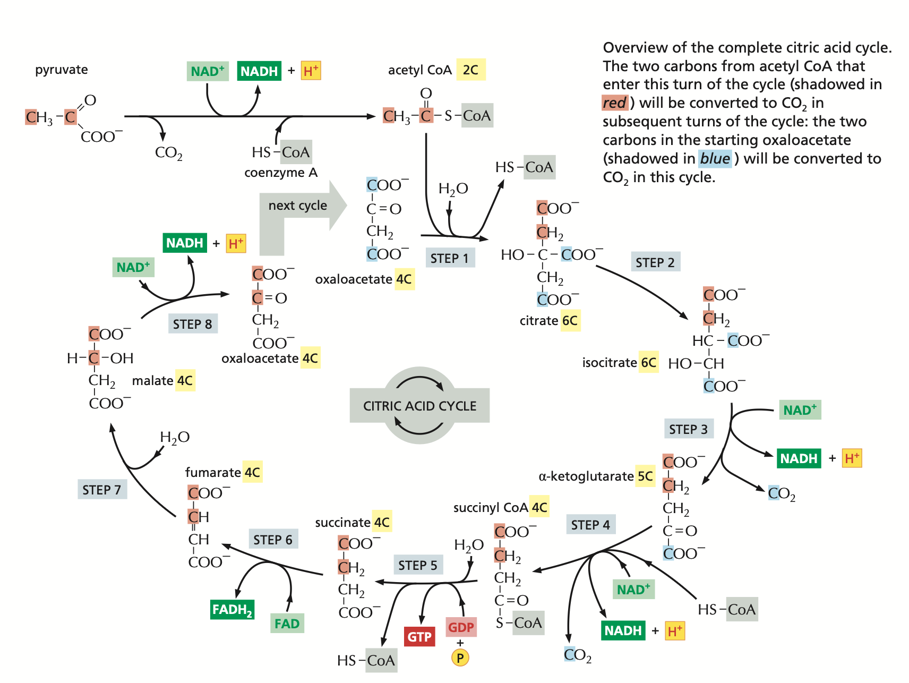

#### Electron Transport Chain (ETC)
Also called the respiratory chain it contains over 40 protein groups, but can be divided into three **respiratory enzyme complexes** (The names are not curriculum)
- (Complex I) NADH dehydrogenase complex - "powered" by the two high-energy electrons of the $NADH$
- (Complex II) - **Ikke i bogen** -  Succinate dehydrogenase is a part of the cirtus acid cyclus
- (Complex III) Cytochrome c reductase complex - "powered" by the high-energy ubiquinone, activated by the NADH dehydrogenase complex or $FADH_2$ through complex II
- (Complex IV) Cytochrome c oxidase complex - "powered" by the reduced cytochrome c
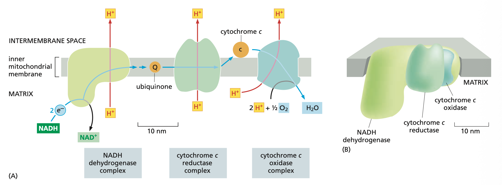

##### Redox reactions
The process of transporting protons across the membrane, is possible as a result of the reduction/oxidation reactions. In **aqueous environments** electron carriers, that are **reduced** (receives an electron) often receives a **$H^+$ from the water** to balance the charge. On the other hand an electron carrier which is **oxidized** (looses an electron) also releases a $H^+$ into the water. The trick is, that the **transmembrane molecules** receives a proton in the water on one side of the membrane, and releases a proton to the water on the other side:
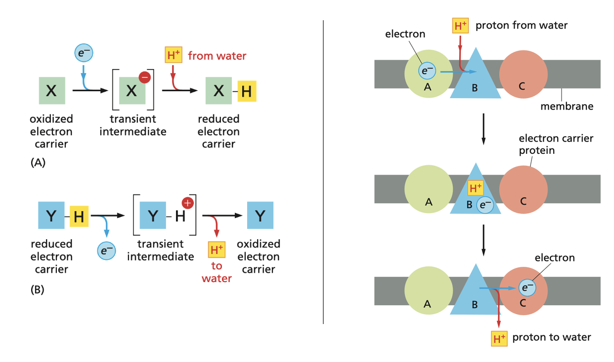
The sequence of **redox-reactions** of the ECT proceeds spontaneously as they have a negative $\Delta G$. This is a result of the difference in **electron affinity**. Low electron affinity molecules such as NADH readily passes electrons to molecules with higher electron affinity (the NADH dehydrogenase complex).

NADH is a strong electron donor (Very favorably $\Delta G$ of electron transfers) and as a result $NAD^+$ is a very weak electron donor. This is measured **experimentally** for **redox pairs** ($NADH/NAD^+$) as a **redox potential** (in volts). The higher the redox potential, the higher the affinity for electrons - that is redox pairs with low potential, transfer their electrons to redox pairs with high potential.
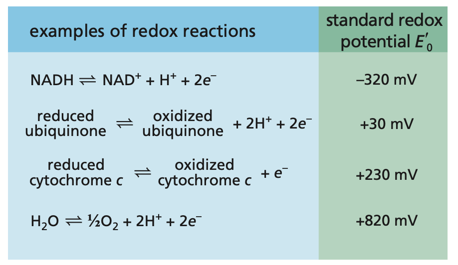

The difference in redox potential $\Delta E'_0=E'_{0,\text{acceptor}}-E'_{0,\text{donor}}$ is a direct measure of $\Delta G \degree$, and thus the describes how energetically favorable the electron transfer actually is. 
($\Delta G \degree = -n(0.096)\Delta E'_0$, where $n$ is the number of electrons transferred per $\Delta E'_0$ mV change in redox potential)

If the NADH transferred the electrons directly to $O_2$ the $\Delta E'_0$ would be so huge, that a ton of energy would be released as heat. By **splitting the reaction** into multiple transfers and thus pumping many protons across the membrane, we utilize as much as the free energy as possible.

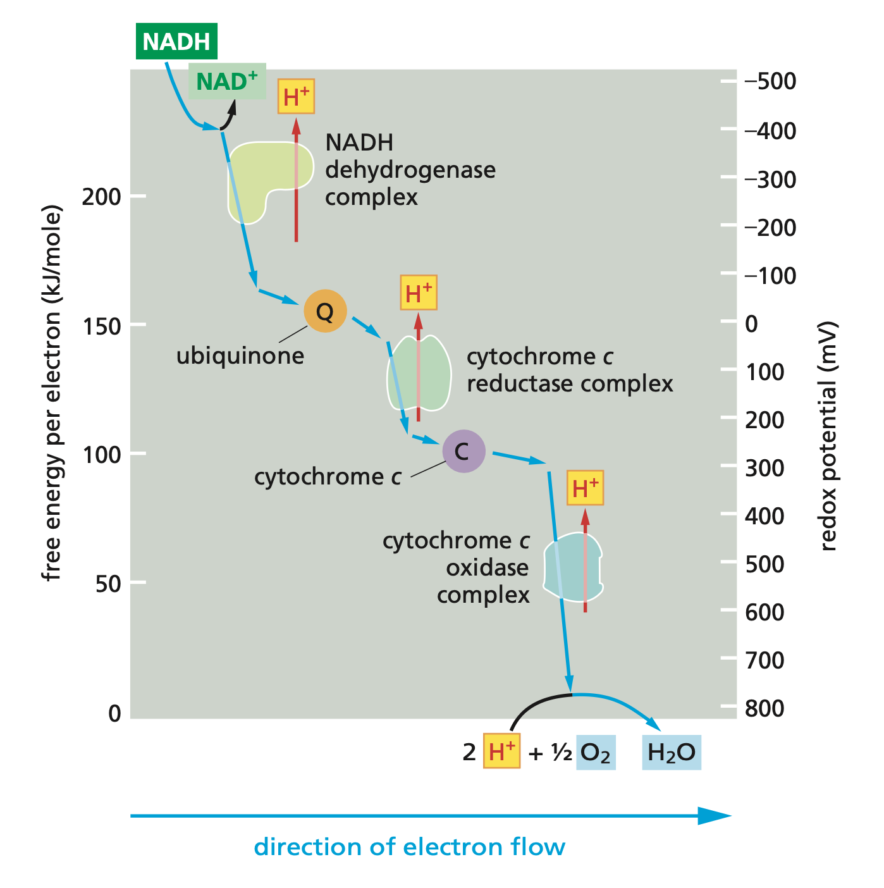

##### The Respiratory Complexes
Each of the complexes utilizes metals with different electron affinities, which allows a donated electron to **skip between embedded metal ions within the complex**. When transferring between complexes, the electrons are passed to electron carries that can **diffuse freely in the lipid bilayer**. 
- The **iron-sulfur centers** have low affinity and are present in the NADH dehydrogenase complex
- The iron in a **heme group** have somewhat higher affinity and are present in both cytochrome c reductase, cytochrome c oxidase and cytochrome c itself. 
The slight **difference in structure** and **amino acid environment** determines the electron affinity of the ions, and thus can a "staircase" along the complex be built. The energy from the electron transport are though to bring the complexes into a conformation where $H^+$ affinity goes from high to low, and can be released in the inner membrane side
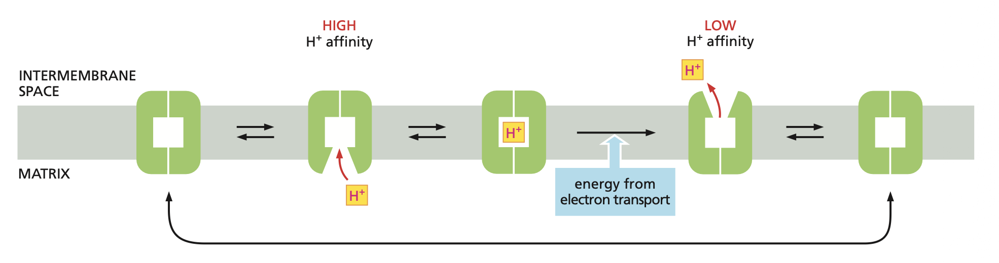

The **ubiquinone** is a molecule with a long hydrophobic tail and a carbon ring, that **can accept two electron** (and protons). This picks up electrons from the NADH dehydrogenase complex, and delivers them to the cytochrome c reductase complex. 
	It can also **accept electrons directly from $FADH_2$** generated in the citric cycle and fatty acid oxidation
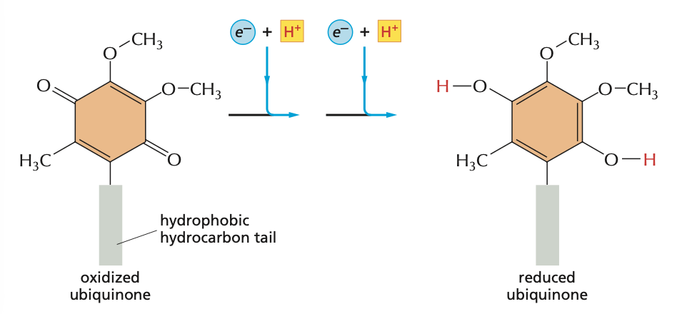

The **cytochrome c** is another electron carrier, that **accepts four electrons** from the cytochrome c reductase (hence the name), moves **along the membrane in the inner membrane space** (not in the lipid bilayer), and transfers them to the cytochrome c oxidase (hence the name). 
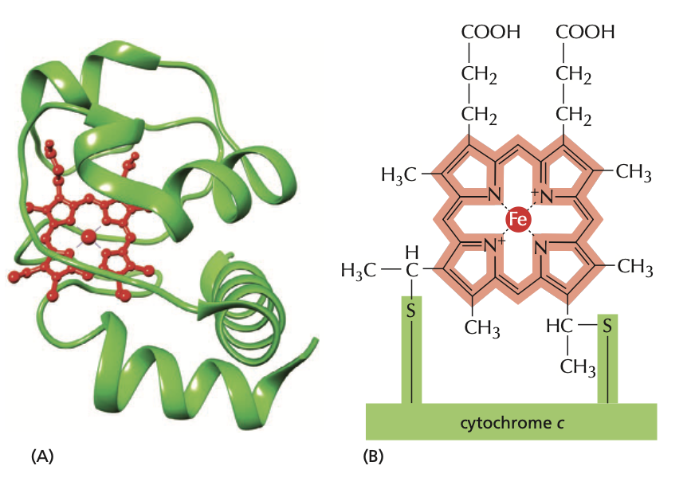

The **cytochrome c oxidase** is where the $O_2$ is reduced. It has the highest electron affinity in the chain. An **oxygen binding site** contains a heme group and a copper atom. Here four electrons (and protons) are transferred to $O_2$ resulting in $2H_2O$ while **four other protons are pumped across the membrane**. 
	Toxins such as **cyanide** is highly dangerous because it binds tightly to the cytochrome c oxidase halting the electron transport.

#### ATP Synthase
The electrochemical gradient of $H^+$ across the inner membrane, which is created by the elctron transport chain, drives the synthesis of ATP from $ADP$ and $P_i$. This synthesis is facilitated by ATP synthase. 

It consist of 
-  A **stationary head** (of multiple subunits) called $F_1$ ATPase head
	The $F_1$ is kept stationary by the **peripheral stalk** - a transmembrane protein
- A **rotating part** (of multiple subunits) called $F_0$ rotor - A transmembrane rotate-able **$H^+$ carrier** (**Rotor ring**) attached to a **central stalk**

The $F_0$ rotor is driven by the proton influx, which in turn rotates the central stalk inside the $F_1$. This changes the conformation of the $F_1$ head - driving the synthesis of $ATP$ from $ADP$ + $P_i$.
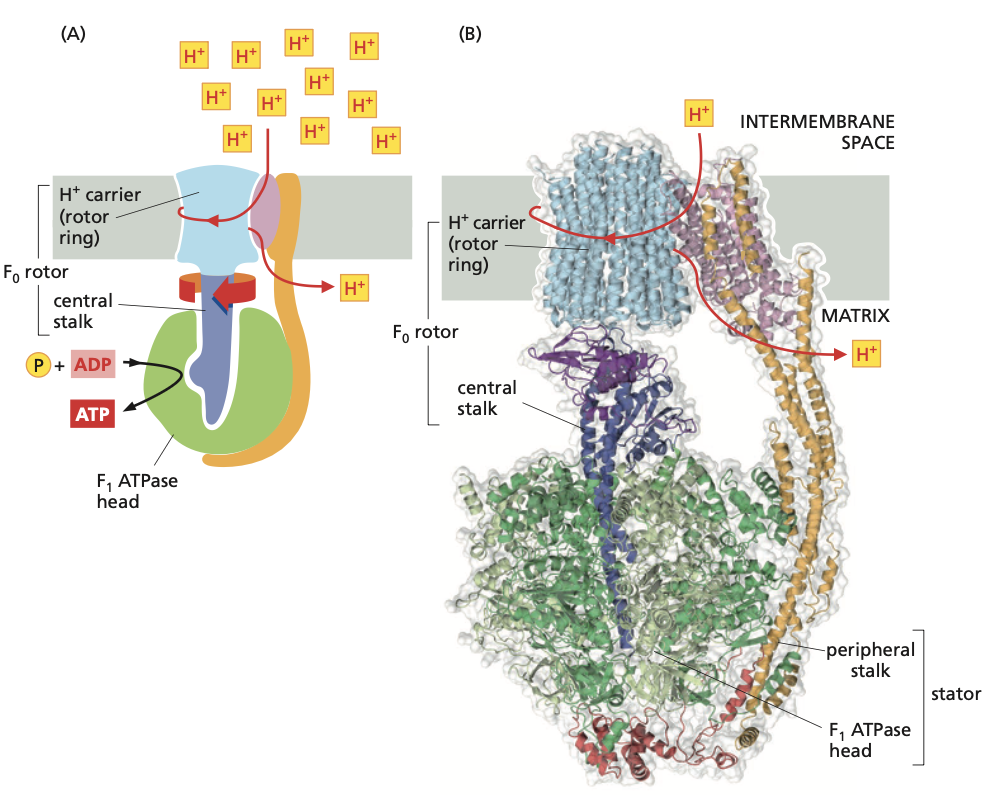

The proces of the ATP synthase is **reversible**, meaning that if the electrochemical gradient of $H^+$ falls below a certain level - it will instead perform ATP hydrolysis to drive the rotor, transporting $H^+$ out of the membrane. 
	The reversal point is when the energy - $\Delta G$ required to synthezise ATP (Which is of course dependent on the concentrations of ATP and ADP) is just equal to the energy delivered by the proton transport

#### $H^+$-gradient Driven Processes
The proton gradient does not only facilitate the synthesis of ATP, but also other processes. 
- **Carrier proteins** transports pyruvate, ADP, $P_i$ into the matrix and ATP out of it. This is agains their **concentration gradients**, and thus requires energy. This is done through coupled transport (Both antiporters and symporters) with the proton influx.
- Other **antiporters** utilize the **membrane potential** created by the electron transport chain to transport (charged) $ATP^{4-}$ out of the cell and $ADP^{3-}$ into the cell.
- Also for protein translocation into the mitochondria (somehow? [Protein distribution](./compartments-and-protein-distribution.md))
- It can have direct functional properties such as in bacteria, where the influx of protons drive the rapid rotation of the flagellum
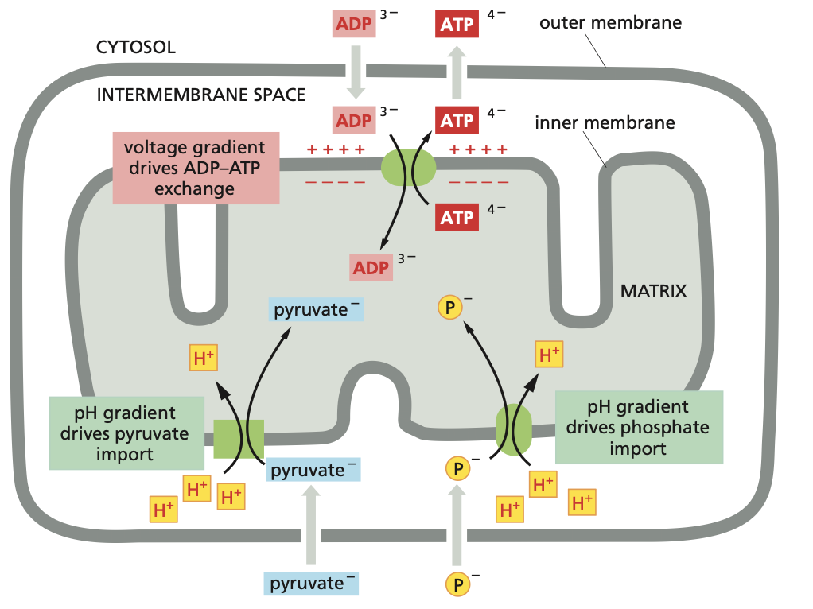
#### ATP production in a Grander Perspective
The cell needs to keep about **10:1 ratio of ATP:ADP** in order to drive the energetically unfavorable reactions, that enzymes catalyze by coupling them to ATP hydrolysis.

The $H^+$ pumping per complex:
- Complex I - Pumps 4 $H^+$
- Complex II - Pumps no $H^+$
- Complex III - Pumps 4 $H^+$
- Complex IV - Pumps 2 $H^+$
And because the ATP synthase synthesises one ATP per 2.7 $H^+$ we have:

When looking at the production values of each process in terms of ATP, we see a highly effective machine of energy-transformation.
- NADH provides net energy to generate about 2.5 ATP in the ETC
- $FADH_2$ provides 1.5 ATP in the ETC
- GDP = ADP in as thay have the same high-energy phosphate bond 

We can thus calculate the total energy of the subprocesses:

| Proces                                   | Direct product              | Final ATP Yield                                 |
| ---------------------------------------- | --------------------------- | ----------------------------------------------- |
| Glycolysis                               | 2 NADH + 2 ATP              | 5 (In the cytosol, so 1 NADH = 3/2 ATP instead) |
| Pyruvate oxidation (To Acetyl CoA)       | 2 NADH                      | 5                                               |
| Acetyl CoA oxidation (Citric Acid Cycle) | 6 NADH + 2 $FADH_2$ + 2 GTP | 20                                              |
Yielding in a total of 30 ATP, which is **$\approx 50\%$ of the total energy** that would be released when burning the sugar. In comparison a motor (Electric or gasoline) opperates at about 10-20% efficiency. - This is freaking awesome by the way
