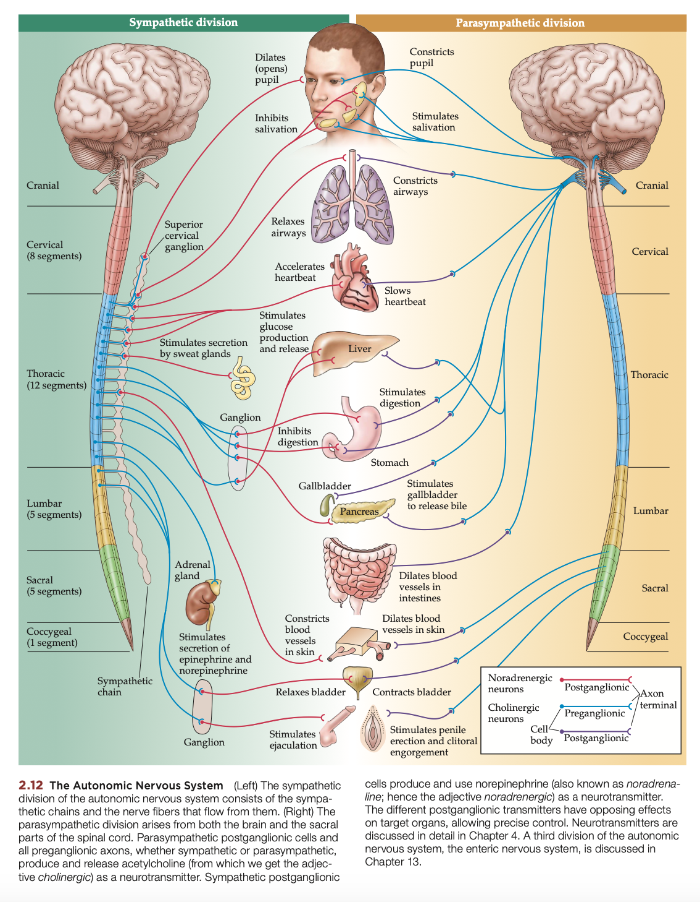
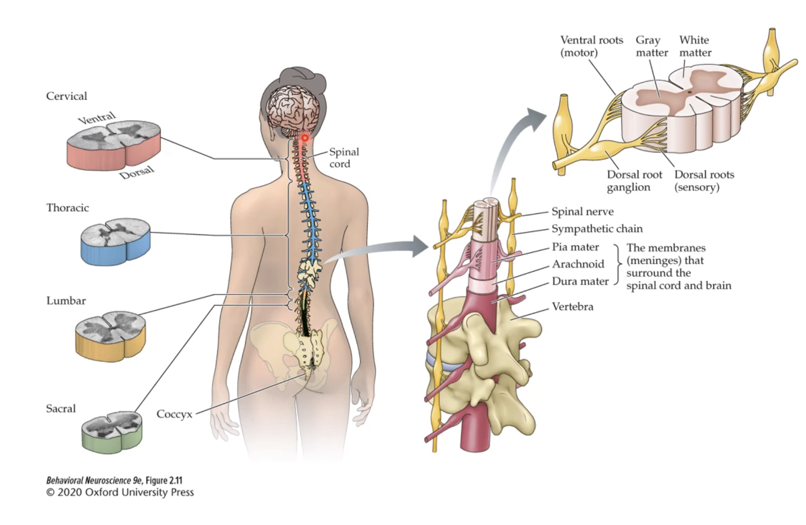
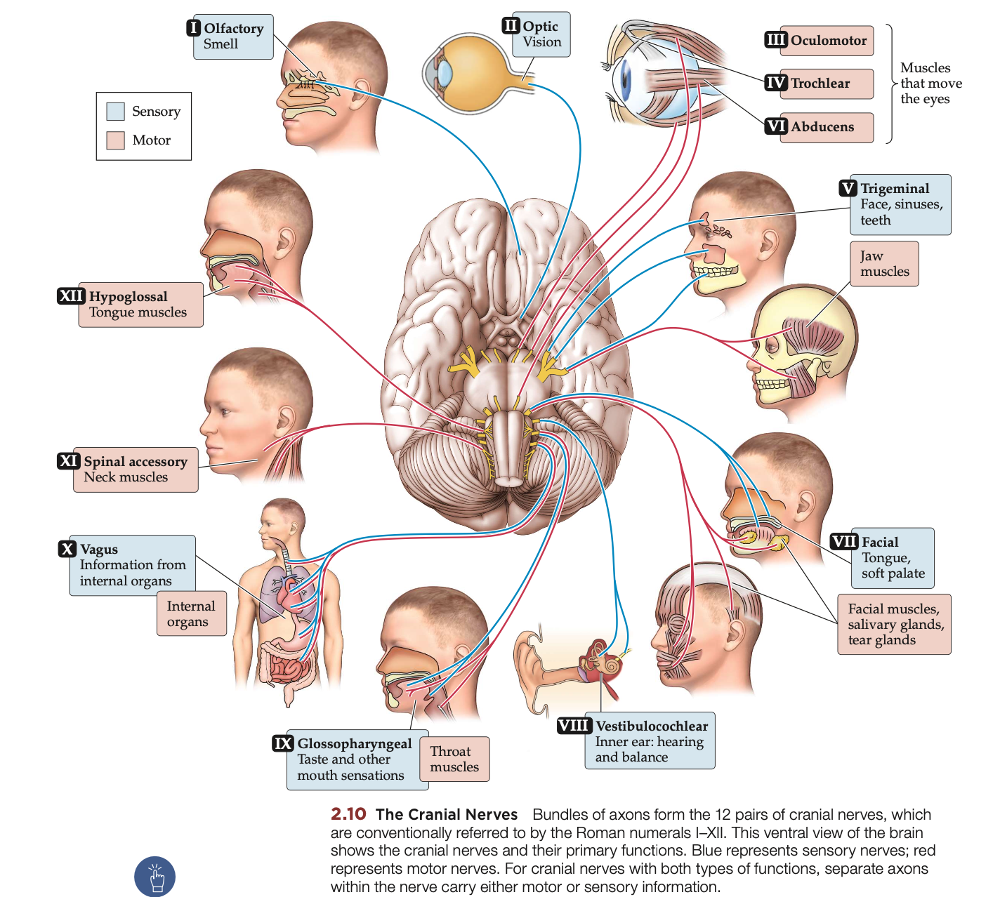

Tags: #Neuroanatomy #Neuroscience 

No synapses in the ganglion of the sensory PNS!
#### Autonomic Nervous System 
Parts of the ANS is actually in the CNS, that is the preganglionic neurons.

Mainly controls the viscera (Internal organs)

###### Autonomic Ganglia
Autonomic ganglia are clusters of nerve cell bodies located outside the central nervous system (CNS) that play a crucial role in the autonomic nervous system (ANS). These ganglia serve as relay stations where preganglionic neurons (part of CNS), originating from the CNS, synapse with postganglionic neurons that innervate target organs such as the heart, smooth muscles, and glands. There are two main types of autonomic ganglia: sympathetic ganglia, which are typically located near the spinal cord and are involved in the "fight or flight" response, and parasympathetic ganglia, which are usually found closer to or within the target organs and mediate the "rest and digest" functions. By integrating and modulating neural signals, autonomic ganglia ensure the appropriate regulation of involuntary physiological processes, maintaining homeostasis and enabling the body to respond effectively to internal and external changes.

##### Sympathetic Nervous System (SNS)
The sympathetic nervous system (SNS) is the part of the body’s automatic control system that kicks into gear during stressful or exciting situations, often referred to as the "fight or flight" response. When activated, it prepares the body to face challenges by increasing energy and alertness. This system uses chemical messengers called neurotransmitters to communicate: [preganglionic](#autonomic-ganglia) neurons release acetylcholine, which signals [postganglionic](#autonomic-ganglia) neurons, and these neurons then release norepinephrine (Noradrenaline) to influence target organs like the heart, lungs, and blood vessels. As a result, the SNS triggers effects like a faster heartbeat, widened airways, and heightened focus, helping you react quickly to danger or pressure. By managing these rapid changes, the SNS ensures the body can handle stress and maintain balance in demanding situations.

##### Parasympathetic Nervous System (PSNS)
The parasympathetic nervous system (PSNS) is the calming counterpart to the sympathetic nervous system, often referred to as the "rest and digest" system. It works to conserve energy and promote relaxation, helping the body recover and maintain balance after stress or activity. The PNS uses neurotransmitters to communicate: preganglionic neurons release acetylcholine, which signals postganglionic neurons, and these neurons also release acetylcholine to influence target organs like the heart, digestive system, and salivary glands. This activation slows the heart rate, stimulates digestion, and encourages processes like nutrient absorption and waste elimination. By fostering a state of calm and restoration, the PNS ensures the body can recharge and function efficiently during periods of rest and recovery.

#### The Enteric Nervous System
The Enteric Nervous System is a local network of sensory and motor neurons that regulates the functioning of the gut, under the control of the CNS. Because it regulates digestive activities of the gut, the enteric nervous system plays a key role in maintaining fluid and nutrient balances in the body.

#### Somatic Nervous System

##### Spinal Nerves

##### Cranial nerves

