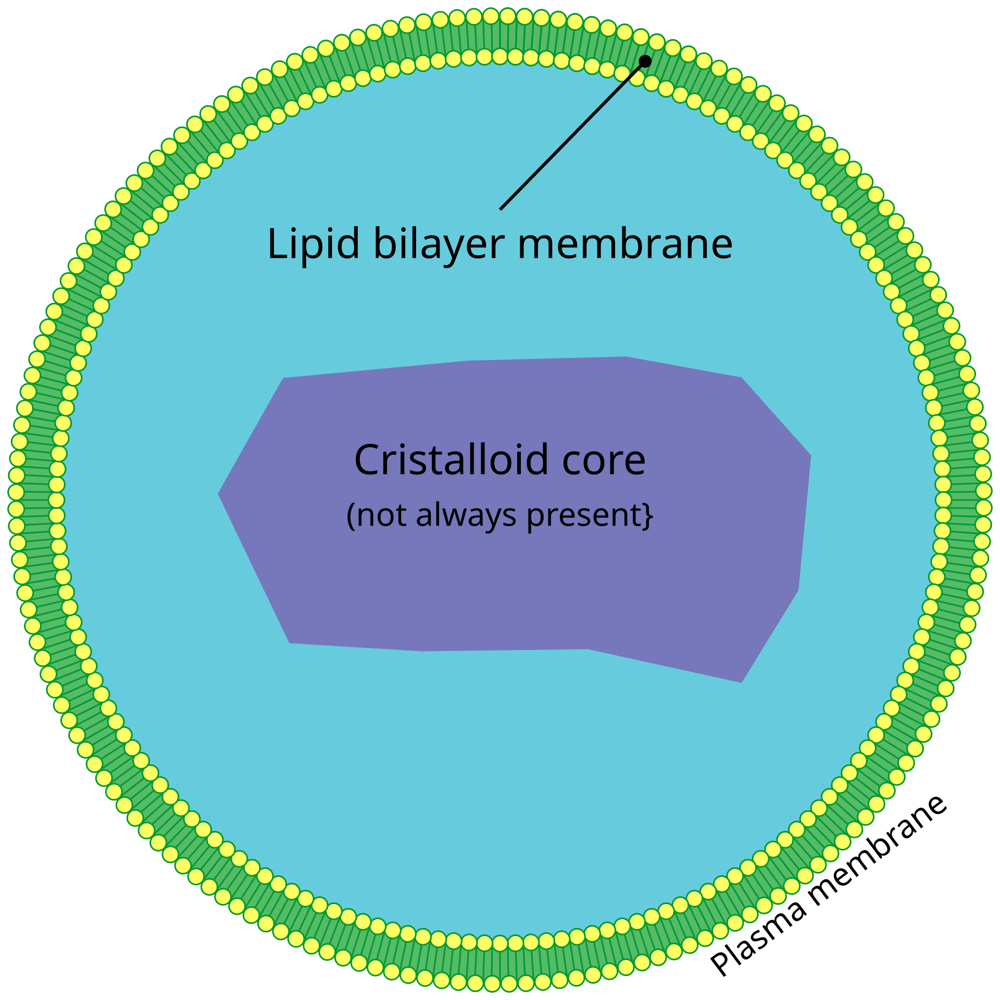

The function of peroxisomes is to use oxygen to degrade lang chains of fatty acids to medium-long chains by **beta-oxidation**. These medium-long fatty acid chains plays **a role in the citrus acid cycle**.
- Some of these - **plasmalogen**, is the lipid most abundant in the myelin sheets

Another important function is the oxydation of toxins, the reaction of which produces **hydrogen peroxide ($H_2O_2$)** - thus its name.  This removes dangerous radicals from the cytoplasma.
- Hydrogen peroxide can be split to $H_2$ and $O_2$ by **catalase**

A special feature of the perixsome, is that proteins with the designated **signal sequence** can inter the peroxisomes **fully folded.**

