Tags: #Neuroscience #CellBiology 

Every neuron forms between 1000 and 10000 synapses to other nerves.
Given $\approx 10^{11}$ we have $10^{11}*10^{3}=10^{14}$ synapses (Hundrede millioner millioner)
#### Synaptic morphology
There is multiples locations of synapses between neurons
- **Axo-dendritic** synapses on the dendrite (dendritic spines mostely)
- **Axo-somatic** synapses directly on the soma/pekaryon
- **Axo-axonic** synapses are often times synapses near axon terminal of another neuron (modulating the next synapse for example)

There are two types of synapses
- **Electrical** synapses $<1\%$ - When current flows directly between the neurons
- **Chemical** synapses - When presynaptic neurons release vesicles of transmitters in the synaptic cleft

#### The Electrical Synapsis
In the electrical synapsis, the presynaptic and postsynaptic neuron are connected by a **gap junction**. The channels in the gap junction consists of two **halves** called **connexons**, each of which consists of **6 connexines**
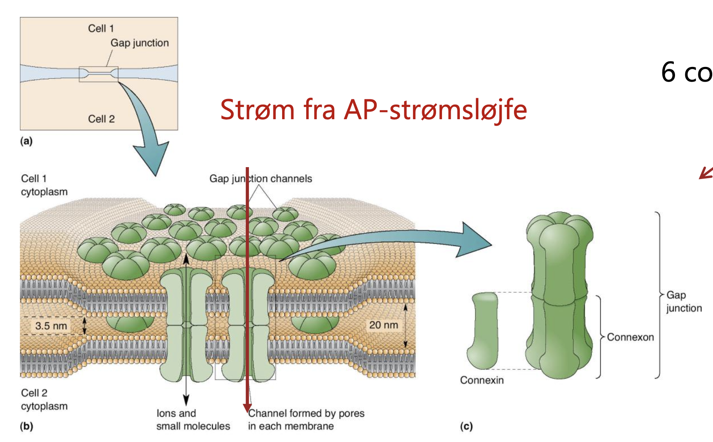

- They are **really fast** - with an delay of **0.2 to 0.5 ms**
- They are **bi-directional**, meaning that an action potential can deliver current and thus depolarize in both directions
- They **retain the "charge"** of the transmission (If the presynaptic transmission is positive then the postsynaptic potential is positive and vice versa)
- They can control their effect size by opening/closing the gap junctions
- They **work in synchronization** mostly, meaning that the **almost** all actions potentials in the presynaptic neuron creates an action potential in the postsynaptic current
- Often time, the electrical synapses is **not between axon terminal and densrite**, but instead they are **located between somas** of different neurons 
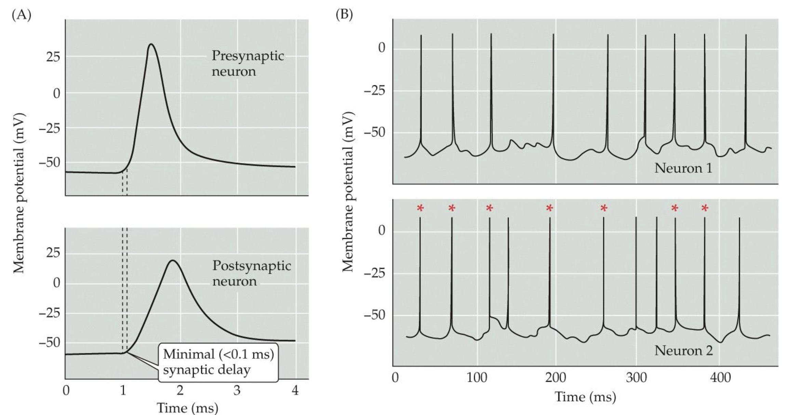

## Chemical synapses
For the chemical synapses we can look ath the pre-synaptic mechanisms, the post-synaptic mechanisms, and the synaptic cleft
#### Morphology of Chemical Synapses
What we see in the microscope is the **axon terminal** with a lot of vesicles and the **active zone**, where the calcium channels and vesicle exocytosis takes place, in the presynaptic cell, and the **postsynaptic density** where the receptors are placed.
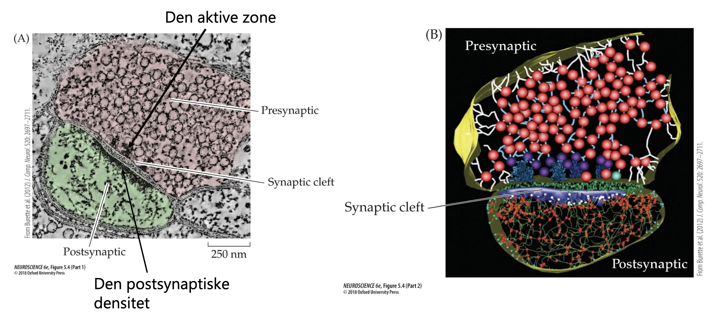

Chemical synapses have a number of qualities
- They are "**slow**" with a delay $>1$ ms
- They are **unidirectional**
- They **can reverse the signal** (or not)
- They are very **plastic**

### Pre-synaptic mechanisms

#### Vesicles and the Active Zone
There are quite a portion of membrane proteins facilitating the functions of the transmitter vesicles. Some of the most important are
- **Synaptobrevin** also called **v-SNARE**, which is part of the SNARE-complex when the vesicle is **primed**
- **Synaptagmine-1** (**Syt1**) acts as the $Ca^+$ binding site
- **Rab3** plays a role in binding to **RIM**, keeping the synaptotagmine-1 close to the $Ca^{2+}$-channels
- **V-ATPase** is important for pumping $H^+$ out of the vesicles. This is used creating a **electrochemical gradient** for transporting neurotransmitters into the vesicle by **symport**
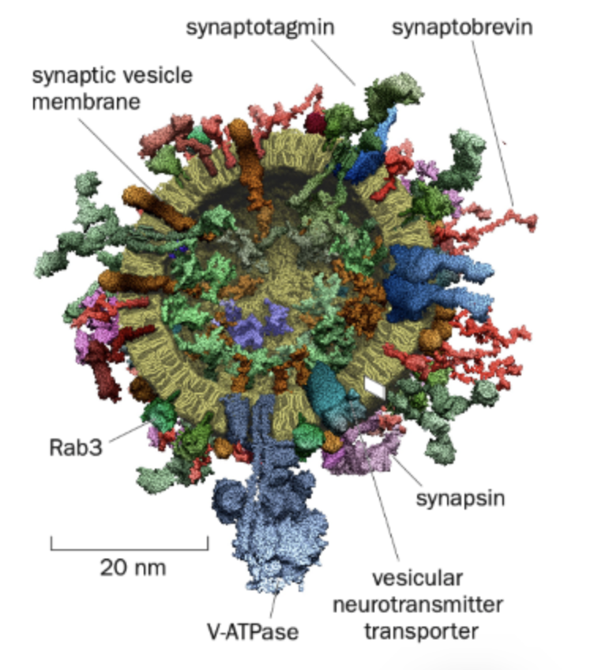
Vesicles can be in three states:
- Freely diffusing vesicles (not ready for exocytosis) (98%-99% of vesicles)
- **Tethered / Docked vesicles** - in the active zone, but not primed for fusion yet
- **Primed vesicles** - Activated, waiting for fusion, by $Ca^{2+}$ signalling

Only 1-2% of vesicles are primed - These are called the **Readily Realsable Pool**.

When **docked**:
- The **Rab3** on the vesicles tethers to the **RIM**, which binds to **RIM-BP** and the $Ca^{2+}$-channels
	This keeps the **synaptotagmin** close to the site af $Ca^{2+}$ influx. 
- **Unc13** binds to t-snares **SNAP-25** and **Syntaxin-1**, while tethering to **synaptobrevin**, thus pulling the vesicle to the release site. 

When being **primed**:
- **Munc18** replaces unc13
- The **SNARE-complex** forms by synaptobrevin "curling/zipping" together with syntaxin-1 and SNAP-25
- **Complexin** in the SNARE-complex blocks fusion of the membranes
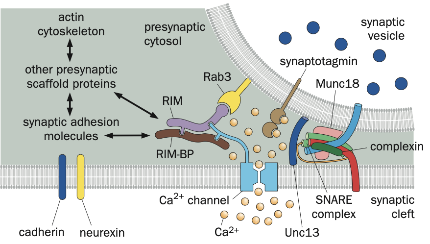

The synaptotagmine has **two binding sites** for $Ca^{2+}$ called **c-domains**, and when they bind
- (From lecture) the positivity of the ions, allows the negative membranes of the vesicle and plasma membrane to get close and fuse
-  (From book) the complexin is displaced, allowing the SNARE-complex to "zip"
As a result of both, the membranes fuse, and the neurotransmitters are released into the synaptic cleft.

The influx of $Ca^{2+}$ is very **transient** ($\approx$ 0.5 ms), meaning that it is a very local domain of high $[Ca^{2+}]$. 
- The **nano domain** of a single channel is why the protein-structures keep the **synaptotagmin** close to the channel, so that it can be activated across **20-50 nm**.
- **Multiple channels** can create a **micro domain**, with longer diffusion time, which begins the fusion of multiple vesicles over a **longer time scale and delay**
#### Post Fusion
After fusion, the SNARE-complex must be pulled apart. **N-ethylmaleimide-sensitive fusion protein (NSF)** binds to the SNARE-complex, which **disassembles it** with the **energy delivered by ATP-hydrolysis** 
- **SNAP-25** and **syntaxin** remains in the plasma membrane
- **Synaptobrevin** returns to synaptic vesicles by endocytosis (different mechanisms)
- The name SNARE comes from Soluble NSF-Attachment protein Receptor

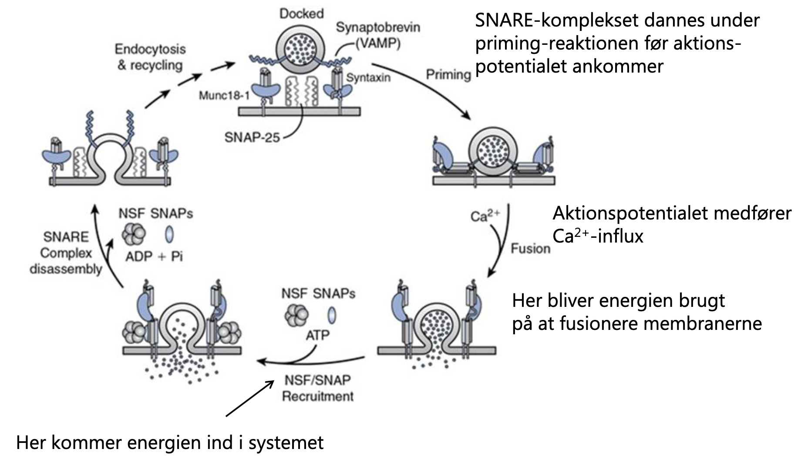
##### Mechanism of Neurotransmitter and Vesicle Reuptake
After release of NTs into the synaptic cleft, they are either ...
1. **Kiss-and-run** (We dont believe that?) - Fast (10-20s)
	This involves a **transient** fusion followed by immediate closing of the pore and endocytosis, such that the proteins of the vesicles doesn-t mix with the plasma membrane proteins
2. **Endosomal recycling** - Slow (About 1 min)
	Bulk membrane forms large endosomal vesicales, which can be "cleaned" before forming new synaptic vesicles
3. **Clathrin-mediated endocytosis**
	Here the synaptic vesicles completely collapses with the plasma membrane, followed by **clathrin-mediated** endocytosis
4. **Clathrin-Independent endocytosis** (ingen eksamensspørgsmål) (100ms)
	Endocytic vesicles larger than synaptic vesicles are produces next to the active zone, which "swallows" everything, fusing with synaptic endosomes, where normal **clathrin-mediated vesicles forming** happens

#### Post-synaptic Mechanism
##### Receptors
Receptors of the postsynaptic side are divided into
- **Ionotropic receptors** which opens an ion channels directly (A few miliseconds)
- **Metabotrobe receptors** are indirect receptors, that can have a multitude of effects - but some open ion channels, just must slower than the ionotropic receptors (100 ms to minutes)
Some neurotransmitters can activate certain types of both receptors, while others are unique ot one of the receptor types. (See [Neurotransmitters and Receptors](./neurotransmitters-and-receptors.md))

**The nicotinic acetylcholine receptor (nAChRs)** is a good example of an ionotropic receptor.
It is present int he **neuromuscular junction (NMJ)** where the motor neurons form synapses on the muscle fiber. The postsynaptic part in the NMJ is called the **motor end plate**.

The **nAChR** has five subunits, where at least two are $\alpha$-subunits.
- The binding of two acetylcholine results in a conformational change, which makes the pore permeable to both $K^+$ and $Na^+$.
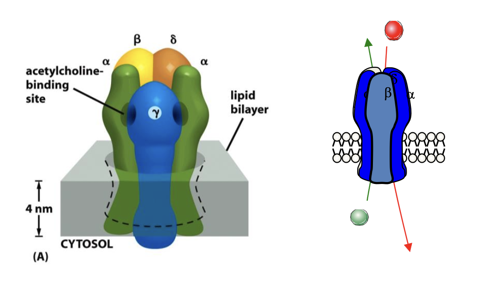
The acetylcholine is only present shortly in the synaptic cleft, as the enzyme **acetylcholinesterase** is quick to degrade the acetylcholine into acetat and choline, which is transportet into the presynaptic cell by $Na^+$ symporters. 

A lot can go wrong in this process
- Toxins can **block** the nAChRs causing paralysis and asphyxiation
	- **curare** - Paralyzing agent used by indegenous tribes in south america (blowing pipes)
	- **$\alpha$-bungarotoxin** - Venom of the many-braided krait (snake)
- Toxins can activate the nAChRs 
	- **Nicotine** (giving name to the receptor) 
- Diseases include
	- **Lambert Eaton Myastehnic Syndrom**  - The presynaptic $Ca^{2+}$-channels of NMJs are reduced, resulting in muscular weakness
	- **Myasthenia gravis** - Disease where antibodies target **nAChRs** and thus weaknings the synapses
- Toxins can block the acethylcholinesterase - Used both for medicin and poison
	- **Sarin** and **VX** - Both are nerve gasses that kills you quickly by asphyxiation, as the muscles (including the diaphragm) becomes unsuable
	- **Malathion** - Insectiside
	- **Neostigmine** - Medicine for opposing blockers of acethylcholine (Agains myasthenia gravis)

#### Neurotransmitters
What is a neurotransmitter? Three critera:
1. It exists in neurons
2. It is released as a result of an action potential
3. It activates a receptor in the post synaptic cell

They can be classified in three groups (Which is a bit weird, as the neurotransmitter is only as excitatory and inhibitory as its receptor, and the same neurotransmitter can have different functions in different synapses)
- **Excitatory neurotransmitters** - Glutamate, acetylcholin (in muscles), serotinine (sometimes)
- **Inhibitory neurotransmitters** - GABA (In cortex and cerebellum) , glycin (in the brain stem and spine)
- **Modulatory neurotransmitters** (Metabotrobe receptors) - Noradrenalin, dopamine, serotonin, histamine, acetylcholin (in CNS)

The neurons can also release peptide chains called **neuropeptides**, which can have properties of a neurotransmitter.

##### Reversal potential
Each channel has a reversal potential, that is **dependent on the ion concentrations** extracellular and intracellular. For receptors permeable to only one ion, the reversal potential is equal to the **equilibrium potential** for that ion.

Som channels are permeable to multiple ions (E.g. AMPA is permeable to both $K^+$ and $Na^+$). This mean that the reversal potential is equal somewhere between the two equilibrium potentials. (For AMPA it is about 0 mV). The current of a channels is dependent on the **memrabane potential** and the **reversal potential**.

##### Excitatory neurotransmission
A transmission is exitatory (stimulating) if it **increases the probability** of the postsynaptic cell firing (**EPSP**). This is for example the glutamate receptors, and the nAch receptors, both of which are **permeable to both $K^+$ and $Na^+$.**  Beacause it is permeable to both, the **reversal potential** must be higher than the **threshold** of the action potential
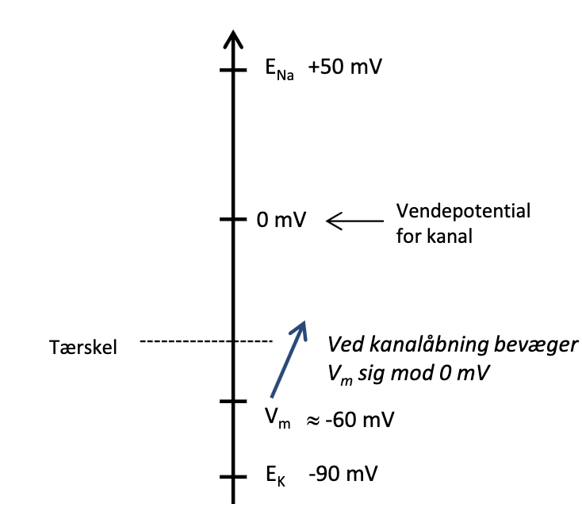

##### Inhibitory neurotransmission 
A transmission is inhibitory if it **decreases the probability** of the postsynaptic cell firing (**IPSP**). This is for example the $GABA_A$ receptor and the glycine receptor. These are permeable to $Cl^-$. The synapses are inhibitory, because **the reversal potential is lower than the membrane potential** - and thus hyperpolarizing the cell.

Sometimes an inhibitory transmission can become exhibitory. If the **intracellular concentration of $Cl^-$** is higher, it can result i the reversal potential of the $GABA_A$ and glycine receptors to become:
- Equal to the membrane potential ($E_{Cl}=V_m$), which is called **shunting inhibition**
- Higher than the threshold, which means, that **they are excitatory** - This is the case for neurons very early in development (**Embryonal**)

##### Summation of transmissions
The potential change from a single EPSP is rarely enough the reach the threshold, and thus multiple synaptic transmissions must be received (both spatially and temporally). 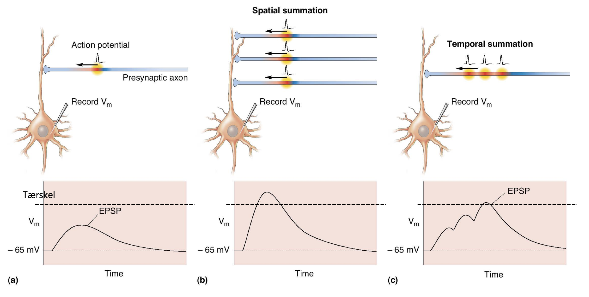
#### Effect of Synapse Location
Most **excitatory synapses** are located at **the dendritic spines** and presynaptic terminals, whereas **inhibitory synapses** are located on **dendritic shafts**, the **soma** and **axon initial segments** (as well as the dendritic spines and presynaptic terminals), making the able to stop the spread of the EPSP via **shunting inhibition**. 
- Modulatory synapses can form all over.

There is also a **factor of distance**, as the magnitude of the potential change declines with distance (Length constant - $\lambda$). Here the **shunting inhibition** also has an effect, as is "shunts" the EPSP, which can be described as lowering the length constant. The two combined effects:
- **Hyper-polarization** of the membrane potential decreases the added effect of the EPSP and IPSP
- **Shunting** allows current to "leak" across the membrane, decreasing the amplitude of the EPSP it self

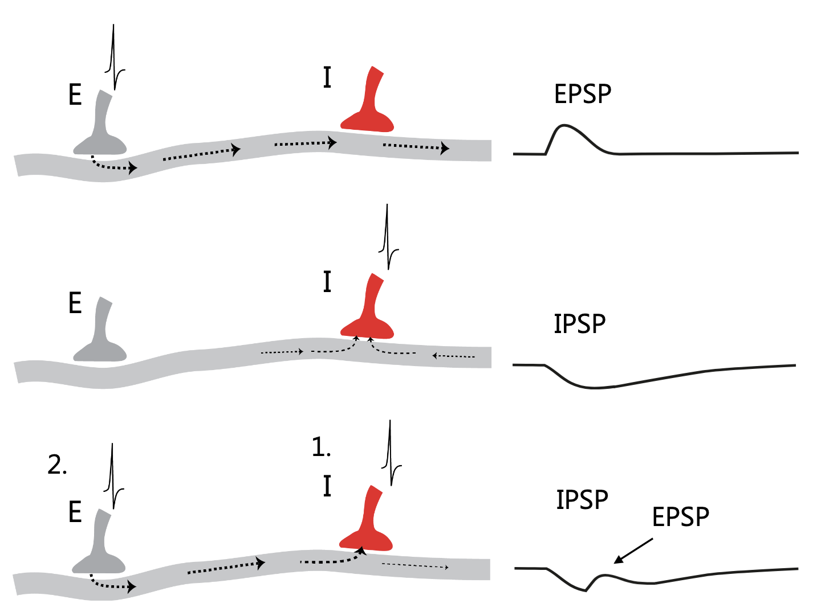

In reality this is a large calculation of multiple EPSPs, IPSPs and shunting inhibitions separated in both time and space
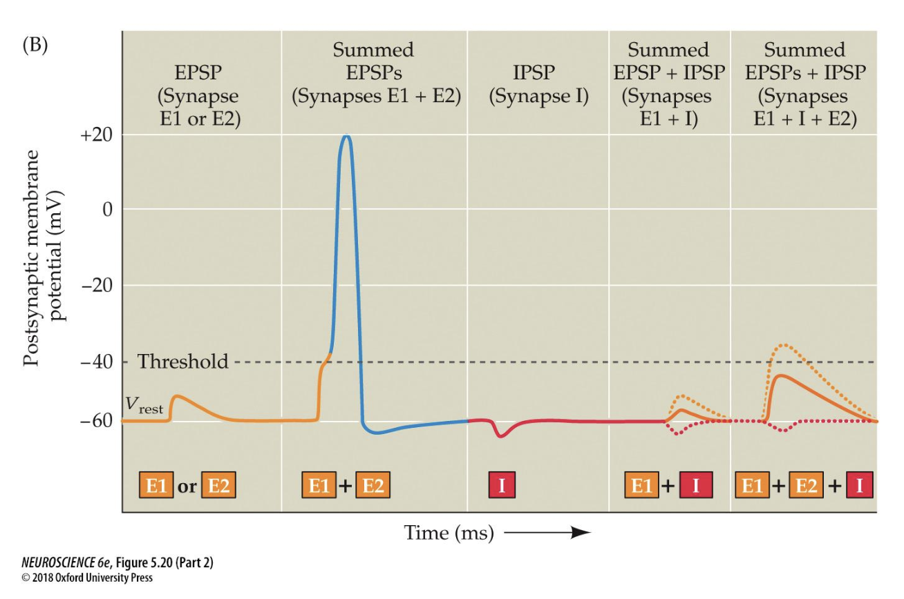

#### Synaptic Quants
Bernard Katz showed that postsynaptic cell (muscle) showed small spikes called **miniature EndPlatePotential (mEPP)**, each of which is the receival of one discrete package or **quant** of neurotransmitters, which we now know is one vesicle. 
- Each vesicle is of a certain size and thus have a **fixed amount of neurotransmitters**
- He also showed by fitting the number of mEPP to the binomial distribution, that the release of quants are stochastic for an action potential. 
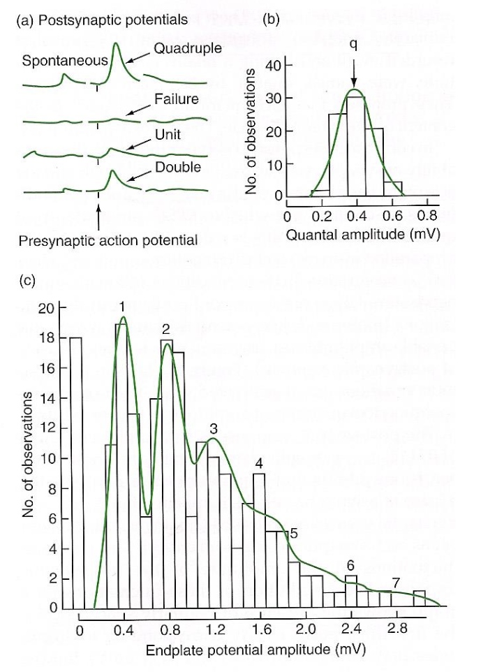
This also means, that not all action potentials deliver neurotransmitters, and as the $Na^+$ channels also are stochastic (they have a probability of activating at a certain voltage), a lot of stochastic activity is integrated in the neuron.
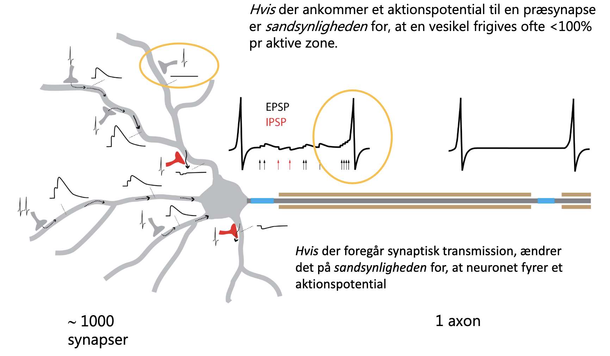

But how does synapses work reliably of they are stochastic? Have **many of them!** The axon can branch and form many parallel synapses with active zones of the same postsynaptic cell - e.g. the motor neurons forming many NMJ on the muscle fiber:
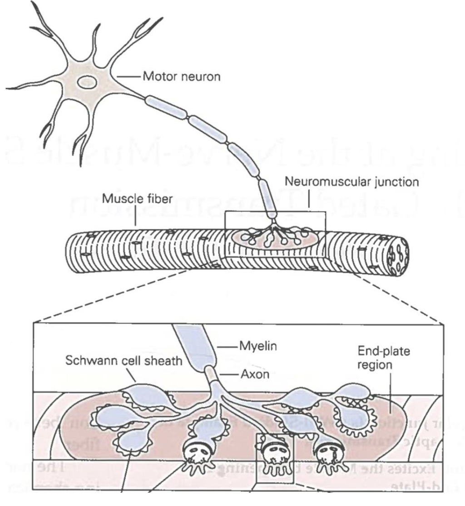
#### Transsynaptic Bridge Proteins
Multiple proteins are used for structuring the synaptic cleft.
- **Neuroxin 1** creates a bridge from the presynaptic cell to the **neuroligin** in the postsynaptic cells
- **Cadherin** bridges the synapase from both sides
We know that there is **active signalling** involving these bridges

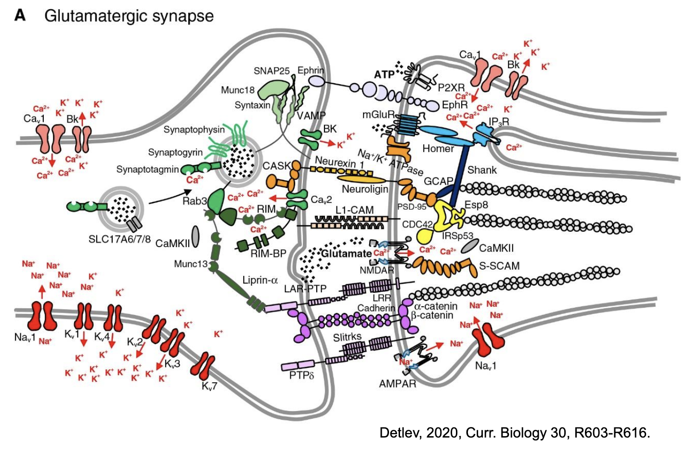

These also keeps the nano-columns in place, such the the receptors and transmitters are kept just in the right places for effective signalling

#### Tripartite Synapses
When an astrocyte surrounds a synapsis, which has metabotropic neurotransmitter receptors, which can release molecules, that can affect the post- and presynapse. 

#### Synaptic Creation and Pruning
The synapses form especially in the embryonic stage and the postal-natal period, but continue out entire lives.

From the puberty we begins pruning the synapses
- Too much pruning might be a mechanism behind schitzophenia

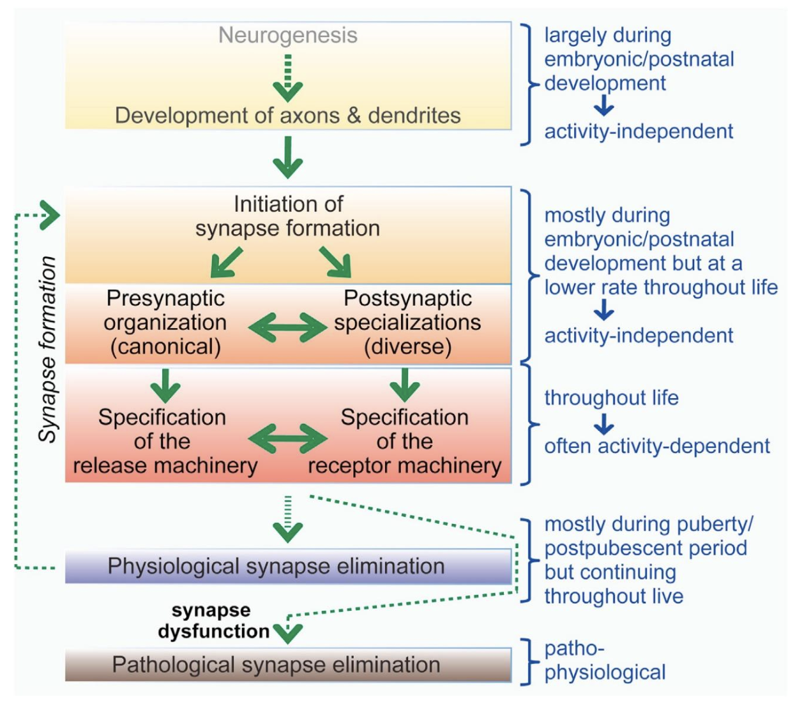
